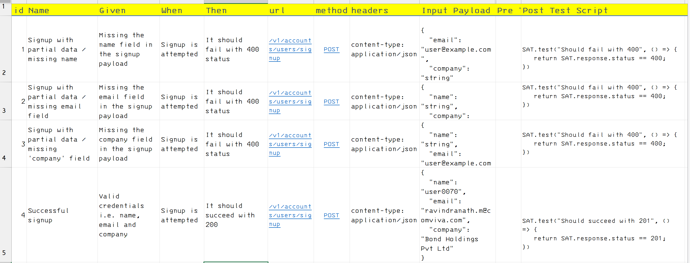

[](https://github.com/rv-nath/satyanaash/actions/workflows/rust.yml)

# satyanaash
A delusional framework for automatic testing of http endpoints

## Brief
This is a http request /response testing framework, inspired mostly by Postman.  A simple cli tool that can run test cases defined in an excel file in an opinionated format.  This framework is purely written in Rust and is terminal application.


## Installation
Simply download the executable file from the Github using the following link:  `//TODO`

Check if the binary is working properly for your operating system.  Run the executable with -h or --help to see if this emits a meaningful usage output.

```shell
Usage: ./satyanaash [options]

Options:
    -s, --start_row START_ROW
                        Set the start row
    -e, --end_row END_ROW
                        Set the end row
    -b, --base_url BASE_URL
                        Set the base URL
    -t, --test_file TEST_FILE
                        Set the test file
    -h, --help          Print this help menu
    -v, --verbose       Print verbose information
```

## How to use
First you need to decide and define your test requests in an excel file (.xlsx).  Here is a screenshot which shows few samples.





## Limitations
Does not support Windows OS.  Supposed to Work on any *nix.


<br>

