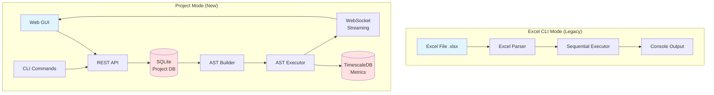
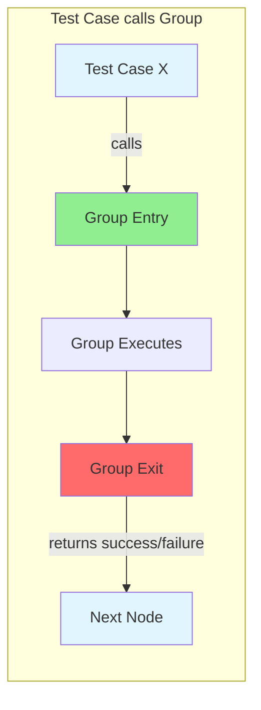
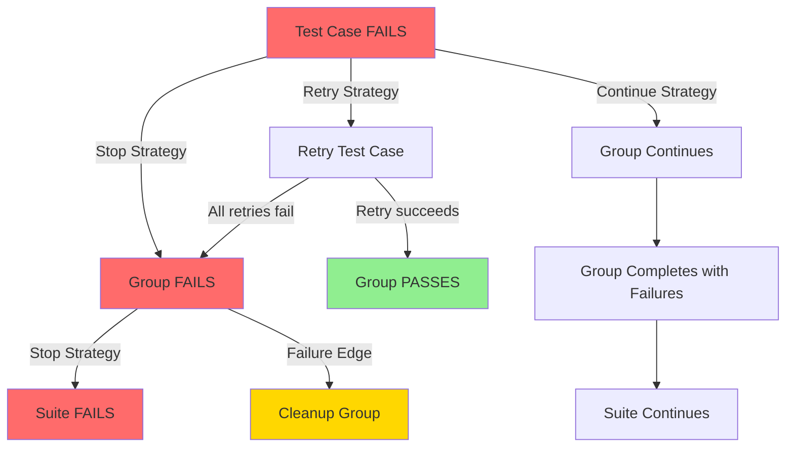
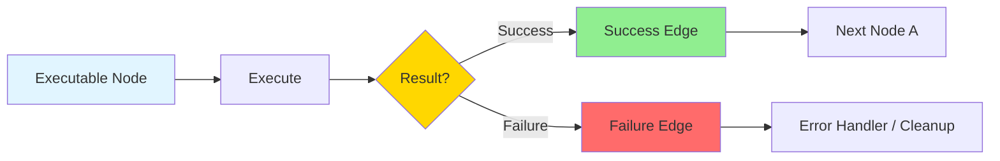

# Satyanaash 2.0 - Requirements Specification

**Version:** 2.0
**Date:** 2025-01-22
**Last Updated:** 2025-01-22
**Status:** Draft (Refined with hierarchical AST and group composition model)

**Key Updates:**
- Added hierarchical AST architecture (Suite → Group → Test Case)
- Added group composition and reusability (groups as functions)
- Added failure handling strategies and propagation
- All operations accessible via CLI and REST API (API spec in DESIGN.md)

---

## 1. Project Vision

### 1.1 Overview
Satyanaash 2.0 is an evolution of the HTTP API testing framework that introduces a graph-based test execution model while preserving the simplicity of Excel-based test definitions. The system will support both a legacy Excel CLI mode and a new project-based mode with visual test composition, advanced control flow, and persistent execution metrics.

### 1.2 System Architecture Overview



### 1.3 Goals
1. **Preserve Simplicity:** Existing Excel-based workflow remains unchanged for simple use cases
2. **Enable Complexity:** Support sophisticated test scenarios with conditional logic, loops, and parallel execution
3. **Visualize Structure:** Provide graph-based visualization of test execution flow
4. **Track History:** Persist execution results and metrics for analysis
5. **Real-time Feedback:** Stream execution progress for live monitoring

### 1.4 Out of Scope (for v2.0)
- Multi-user collaboration
- Cloud deployment
- Authentication/authorization
- Test result comparison/diffing
- Distributed test execution across multiple machines

---

## 2. User Personas

### 2.1 API Tester (Primary)
- **Role:** Individual developer testing their APIs during development
- **Needs:** Quick test execution, Excel familiarity, no complex setup
- **Usage:** CLI with Excel files, ephemeral results

### 2.2 QA Engineer (Primary)
- **Role:** Quality assurance professional building comprehensive test suites
- **Needs:** Complex test flows, reusable test components, execution history
- **Usage:** GUI for building test graphs, scheduled executions, metric analysis

### 2.3 DevOps Engineer (Secondary)
- **Role:** Integrates tests into CI/CD pipelines
- **Needs:** CLI automation, exit codes, machine-readable output
- **Usage:** CLI in Jenkins/GitLab CI, project-based execution

---

## 3. Functional Requirements

### FR-1: Excel CLI Mode (Legacy)
**Priority:** MUST HAVE

**Description:** The system must continue to support the current Excel-based CLI workflow without any changes.

**Requirements:**
- FR-1.1: Accept Excel files (.xlsx) with 12 columns as input
- FR-1.2: Execute tests sequentially in row order
- FR-1.3: Support group markers (rows starting with "Group:")
- FR-1.4: Execute tests without storing any data in databases
- FR-1.5: Print results to console with pass/fail/skip statistics
- FR-1.6: Support all existing command-line flags (-t, -w, -g, -v, -b, -s, -e)
- FR-1.7: Maintain identical output format and behavior
- FR-1.8: Preserve all existing features:
  - Placeholder substitution ({{env:VAR}}, {{input:VAR}}, {{jsVar}})
  - Keyword substitution ($RandomName, $UUID, etc.)
  - Pre/post test scripts (JavaScript)
  - Authentication (authorizer/authorized)
  - Repeat count and delay
  - Multipart file uploads

**Acceptance Criteria:**
- All existing Excel test files execute without modification
- Output format matches current version
- No regressions in functionality

---

### FR-2: Project Management
**Priority:** MUST HAVE

**Description:** The system must support creating and managing test projects. All operations must be accessible via both CLI and REST API.

**Requirements:**
- FR-2.1: Create new project with name and description
- FR-2.2: List all existing projects
- FR-2.3: Delete project and all associated data
- FR-2.4: Get project details (test count, group count, last modified, etc.)
- FR-2.5: Update project metadata (name, description)
- FR-2.6: Each project has its own SQLite database file
- FR-2.7: Project database stores test definitions and version history
- FR-2.8: Projects are stored in a configurable directory (default: ~/.satyanaash/projects/)

**Example CLI Commands:**
```bash
satyanaash project create --name "My API Tests" --description "Auth & User Management APIs"
satyanaash project list
satyanaash project get --name "My API Tests"
satyanaash project update --name "My API Tests" --description "Updated description"
satyanaash project delete --name "My API Tests"
```

**Acceptance Criteria:**
- Projects can be created with unique names
- Project list shows name, description, test count, group count, last modified date
- Deleting project removes SQLite file and all data
- All operations available via CLI and REST API (detailed in DESIGN.md)

---

### FR-3: Test Case Management
**Priority:** MUST HAVE

**Description:** Users must be able to manage individual test cases within projects. All operations must be accessible via both CLI and REST API.

**Requirements:**
- FR-3.1: Create test case with full details (name, URL, method, headers, payload, scripts)
- FR-3.2: Update existing test case
- FR-3.3: Delete test case
- FR-3.4: List all test cases in a project or group
- FR-3.5: Get test case details by ID
- FR-3.6: Test cases preserve all fields from Excel format (Given/When/Then, config, etc.)
- FR-3.7: Test cases can be tagged for organization
- FR-3.8: Search test cases by name or tags

**Data Fields (per test case):**
- ID (auto-generated UUID)
- Name
- Given (BDD format - precondition)
- When (BDD format - action)
- Then (BDD format - expected result)
- URL
- HTTP Method (GET, POST, PUT, PATCH, DELETE)
- Headers (key-value pairs)
- Payload (JSON/form-data/multipart)
- Configuration:
  - Repeat count (default: 1)
  - Auth type (none/authorizer/authorized)
  - Delay in milliseconds (default: 0)
  - Failure strategy (stop/continue/retry)
- Pre-test script (JavaScript, executed before request)
- Post-test script (JavaScript, executed for assertions)
- Tags (optional, for organization and filtering)

**Acceptance Criteria:**
- Test cases can be created via CLI, API, or imported from Excel
- All test case fields are persisted correctly in project database
- Test cases can be retrieved, updated, and deleted
- Search and filtering work correctly (by name, tags)
- All operations available via CLI and REST API

---

### FR-4: Hierarchical AST Graph Building
**Priority:** MUST HAVE

**Description:** Users must be able to organize tests into a two-level hierarchical graph structure: Suite-level graphs composed of Groups, and Group-level graphs composed of Test Cases. Groups are reusable components that can be called from multiple locations.

**Hierarchical Structure Diagram:**

```mermaid
graph TB
    subgraph "Suite Level (Macro-Graph)"
        SEntry[Entry] --> GA[Group A]
        GA -->|success| GB[Group B]
        GA -->|failure| GC[Group C]
        GB --> GCleanup[Group Cleanup]
        GC --> GCleanup
        GCleanup --> SExit[Exit]
    end

    subgraph "Group A (Micro-Graph)"
        GAEntry[Entry] --> TC1[Test Case 1]
        TC1 --> TC2[Test Case 2]
        TC2 --> GCall[Call Login Group]
        GCall -->|success| TC3[Test Case 3]
        GCall -->|failure| GAExit[Exit]
        TC3 --> GAExit
    end

    subgraph "Login Group (Reusable)"
        LEntry[Entry] --> LTest[POST /login]
        LTest --> LExtract[Extract JWT]
        LExtract --> LExit[Exit]
    end

    style GA fill:#ffd700
    style GCall fill:#87ceeb
    style LEntry fill:#90ee90
```



**Group Composition Visualization:**



**Requirements:**

**FR-4.1: Two-Level Hierarchy**
- **Suite Level (macro-graph):** Groups connected by edges
- **Group Level (micro-graph):** Test cases and group calls connected by edges
- Maximum 2 levels of nesting (Suite → Group → Test Case)
- Groups are self-contained, reusable components

**FR-4.2: Suite-Level Node Types**
- **Group Node:** Executes a group (with internal graph), returns success/failure status
- **Conditional Node:** If-then-else branching based on JavaScript expression
- **Loop Node:** Repeat group execution N times or while condition is true
- **Parallel Node:** Execute multiple groups concurrently
- **Entry Node:** Suite start point (exactly one required)
- **Exit Node:** Suite end point (at least one required)

**FR-4.3: Group-Level Node Types**
- **Test Case Node:** Executes a single HTTP test, returns success/failure
- **Group Call Node:** Calls another group (like a subroutine), returns success/failure
- **Conditional Node:** If-then-else branching based on JavaScript expression
- **Loop Node:** Repeat test sequence N times or while condition is true
- **Parallel Node:** Execute multiple test branches concurrently
- **Entry Node:** Group start point (exactly one required)
- **Exit Node:** Group end point (at least one required)

**FR-4.4: Edge Types (same for both levels)**
- **Default Edge:** Always traverse
- **Success Edge:** Traverse only if previous node succeeded
- **Failure Edge:** Traverse only if previous node failed
- **Conditional Edge:** Traverse if JavaScript expression evaluates to true
- **HTTP Status Edge:** Traverse if response status matches (group-level only)

**FR-4.5: Group Composition & Reusability**
- Groups are defined once and can be instantiated multiple times
- Test cases within a group can call other groups (like function calls)
- When a group is called:
  - Execution enters at group's Entry node
  - Group executes from entry to exit
  - Returns success/failure status to caller
  - Caller continues based on conditional edges (success/failure path)
- Groups can be called from:
  - Suite-level (as Group nodes)
  - Group-level (as Group Call nodes from test cases)

**FR-4.6: Cross-Group Constraints**
- ❌ **Forbidden:** Test case in Group A CANNOT edge directly to test case in Group B
- ✅ **Allowed:** Test case can call another group's entry point (Group Call node)
- ✅ **Allowed:** Groups can be nested via group calls (with max call depth limit)

**FR-4.7: Graph Structure Requirements**
- Each graph (suite or group) must have exactly one Entry node
- Each graph must have at least one Exit node
- All nodes must be reachable from Entry node
- No infinite loops (max iteration limits enforced)
- Nodes can have multiple outgoing edges with priority ordering
- When multiple edge conditions are true, highest priority edge is taken

**FR-4.8: Execution Context & State**
- Each group execution has its own JavaScript runtime context (SAT object)
- When group is called, caller's context is passed (JWT tokens, variables)
- Called group can modify context (e.g., set JWT token during login)
- Context modifications propagate back to caller
- Parallel branches have isolated contexts

**Example Scenarios:**

**Example 1: Reusable Login Group**
```
Group: Login (reusable)
  Entry → Test: POST /login → Test: Extract JWT → Exit (success)

Group: CreateUser
  Entry → [CALL Login] ──success──> Test: POST /users → Exit
                       └──failure──> Exit (skip user creation)

Group: DeleteUser
  Entry → [CALL Login] ──success──> Test: DELETE /users/:id → Exit
                       └──failure──> Exit
```

**Example 2: Suite-Level Composition**
```
Suite: API Integration Tests
  Entry → [Group: Setup] ──success──> [Group: Main Tests] ──> [Group: Cleanup]
                         └──failure──> [Group: Cleanup] (always run)
```

**Acceptance Criteria:**
- Suite-level graphs can compose multiple groups
- Group-level graphs can call other groups as subroutines
- Same group can be reused in multiple locations
- Execution follows conditional edges based on success/failure
- Groups return to caller after execution
- Context (JWT tokens, variables) flows correctly between caller and called groups
- Maximum call depth prevents infinite recursion
- Cross-group test case edges are rejected during validation

---

### FR-5: Test Execution
**Priority:** MUST HAVE

**Description:** The system must execute test graphs with support for sequential and parallel execution.

**Requirements:**
- FR-5.1: **Sequential Execution:**
  - Traverse graph from entry node following edges
  - Evaluate edge conditions to determine next node
  - Execute test case nodes by making HTTP requests
  - Update JavaScript runtime context after each test

- FR-5.2: **Parallel Execution:**
  - Parallel nodes spawn multiple execution branches
  - Each branch runs in isolation (separate JavaScript context)
  - Support join strategies: WaitAll, WaitAny, WaitN
  - Shared state (JWT tokens, variables) passed to branches at fork

- FR-5.3: **Conditional Logic:**
  - Evaluate JavaScript expressions for conditional nodes
  - Support accessing test results: SAT.response.status, SAT.response.body
  - Support custom variables: SAT.globals.varName

- FR-5.4: **Loop Logic:**
  - Count-based loops (repeat N times)
  - While pre-condition (check before each iteration)
  - While post-condition (check after each iteration)
  - Max iteration limit to prevent infinite loops

- FR-5.5: Execution stops on first failure (unless in parallel branch)
- FR-5.6: Statistics collected: total tests, passed, failed, skipped, duration
- FR-5.7: Support dry-run mode (validate graph without executing requests)

**Acceptance Criteria:**
- Sequential execution matches current Excel behavior
- Parallel execution runs branches concurrently
- Conditional/loop nodes work correctly
- JavaScript context isolated per execution branch

---

### FR-6: Real-time Progress Updates
**Priority:** SHOULD HAVE

**Description:** The system must stream execution progress in real-time for live monitoring.

**Requirements:**
- FR-6.1: Emit events for:
  - Test suite start/end
  - Test group start/end
  - Test case start/end
  - Node execution start/end
  - Edge traversal

- FR-6.2: Events include:
  - Timestamp
  - Node ID and type
  - Test name
  - Status (running/passed/failed/skipped)
  - Duration
  - HTTP request/response details

- FR-6.3: Events streamed via WebSocket connection
- FR-6.4: Support multiple concurrent subscribers
- FR-6.5: Events buffered if no subscribers connected
- FR-6.6: Latency <100ms from event occurrence to delivery

**Acceptance Criteria:**
- GUI receives real-time updates during test execution
- Progress indicators update without polling
- Connection loss handled gracefully (reconnect)

---

### FR-7: Execution History & Metrics
**Priority:** MUST HAVE

**Description:** The system must persist test execution results for analysis and reporting.

**Requirements:**
- FR-7.1: Store every test run with:
  - Run ID (unique)
  - Project ID
  - Graph version used
  - Start/end timestamps
  - Overall status (completed/failed/aborted)
  - Statistics (total/passed/failed/skipped)

- FR-7.2: Store individual test results:
  - Test case ID
  - Node ID
  - Status (passed/failed/skipped)
  - HTTP request sent
  - HTTP response received
  - Duration
  - Error message (if failed)

- FR-7.3: Query execution history:
  - List recent runs for a project
  - Filter by date range
  - Filter by status
  - Get detailed results for a specific run

- FR-7.4: Aggregate metrics:
  - Pass rate over time
  - Average execution duration
  - Most frequently failing tests
  - Performance trends

- FR-7.5: Data retention:
  - Detailed results: 90 days
  - Aggregated summaries: 1 year
  - High-level metrics: indefinite

**Acceptance Criteria:**
- All executions are logged with full details
- Historical data can be queried via CLI/API
- Old data auto-pruned based on retention policy

---

### FR-8: Version History
**Priority:** SHOULD HAVE

**Description:** The system must track changes to test graphs over time.

**Requirements:**
- FR-8.1: Each modification creates a new version
- FR-8.2: Versions are numbered sequentially (1, 2, 3, ...)
- FR-8.3: Each version includes:
  - Version number
  - Timestamp
  - Commit message (optional, user-provided)
  - Full snapshot of graph (nodes + edges)

- FR-8.4: View version history for a project
- FR-8.5: Rollback to a previous version
- FR-8.6: Compare versions (list added/removed/modified nodes)
- FR-8.7: Execute tests using a specific historical version

**Implementation Note:**
- Simple snapshot-based versioning (no complex diffing)
- Store complete graph structure for each version
- Old versions remain immutable

**Acceptance Criteria:**
- Every change creates a new version with full snapshot
- Users can view version history
- Users can rollback to any previous version
- Old versions can be executed

---

### FR-9: Import/Export
**Priority:** MUST HAVE

**Description:** The system must support importing tests from Excel and exporting projects.

**Requirements:**
- FR-9.1: **Import from Excel:**
  - Read Excel file with current format (12 columns)
  - Parse groups and test cases
  - Convert to AST graph (sequential by default)
  - Create nodes for each test case
  - Create edges for sequential flow
  - Import into new or existing project

- FR-9.2: **Export to Excel:**
  - Flatten AST graph to linear sequence (if possible)
  - Write 12-column Excel format
  - Preserve all test case fields
  - Warn if graph has features not representable in Excel (loops, conditionals)

- FR-9.3: **Export Project Metadata:**
  - Export graph as YAML/JSON for backup
  - Include all nodes, edges, test cases
  - Human-readable format

**CLI Commands:**
```bash
satyanaash import --excel tests.xlsx --project "My Project"
satyanaash export --project "My Project" --excel output.xlsx
satyanaash export --project "My Project" --yaml backup.yaml
```

**Acceptance Criteria:**
- Excel files import correctly with test cases preserved
- Exported Excel files work in legacy mode
- YAML export includes complete graph structure

---

### FR-10: Failure Handling & Propagation
**Priority:** MUST HAVE

**Description:** The system must provide configurable failure handling strategies that determine how test failures propagate through the execution hierarchy (Test Case → Group → Suite).

**Failure Propagation Diagram:**



**Conditional Edge Routing:**



**Requirements:**

**FR-10.1: Failure Strategies (per node)**
Each executable node (test case or group) can be configured with a failure strategy:

- **Stop on Failure (default):**
  - Test case fails → Stop group execution immediately
  - Group fails → Stop suite execution immediately
  - Mark parent as failed

- **Continue on Failure:**
  - Test case fails → Mark as failed, continue to next test in group
  - Group fails → Mark as failed, continue to next group in suite
  - Collect all failures, report at end

- **Retry on Failure:**
  - Test case fails → Retry N times before marking as failed
  - Configurable retry count (default: 0, max: 10)
  - Configurable delay between retries (milliseconds)
  - If all retries fail, apply underlying strategy (stop or continue)

**FR-10.2: Conditional Edge Routing**
When a node completes (success or failure), execution follows conditional edges:

```
Test Case / Group Node
  ↓
Execute
  ↓
Result: Success | Failure
  ↓
Conditional Edges:
  ──success──> Next Node A
  ──failure──> Next Node B (e.g., cleanup/error handling group)
```

- Both test cases and groups follow same routing model
- Edges can be conditional on success/failure status
- Multiple edges evaluated by priority (highest priority first)
- If no matching edge, execution stops (unless continue-on-failure)

**FR-10.3: Cleanup/Finally Semantics**
Support "always run" semantics for cleanup operations:

```
Suite:
  Entry → Group A (main flow) ──success──> Group Cleanup
                              └──failure──> Group Cleanup
```

- Cleanup groups can be connected via both success AND failure edges
- Ensures cleanup always runs regardless of main flow outcome

**FR-10.4: Failure Propagation Examples**

**Example 1: Stop on Failure (default)**
```
Group: UserManagement
  Test 1: Create User  ✅ passes
  Test 2: Update User  ❌ FAILS → Group stops immediately
  Test 3: Delete User  (not executed)

Group Result: FAILED
Suite continues based on edges from Group node
```

**Example 2: Continue on Failure**
```
Group: ValidationTests (failureStrategy: continue)
  Test 1: Validate Email  ❌ FAILS
  Test 2: Validate Phone  ✅ passes
  Test 3: Validate Address ❌ FAILS

Group Result: FAILED (2 of 3 tests failed)
All tests executed, failures collected
```

**Example 3: Retry on Failure**
```
Test Case: Login (retryCount: 3, retryDelay: 1000ms)
  Attempt 1: ❌ FAILS (500 Internal Server Error)
  Wait 1000ms
  Attempt 2: ❌ FAILS (500 Internal Server Error)
  Wait 1000ms
  Attempt 3: ✅ PASSES

Result: PASSED (after 3 attempts)
```

**Example 4: Error Handling via Edges**
```
Group: ProductFlow
  Test: Create Product ──success──> Test: Verify Product
                       └──failure──> [CALL Cleanup Group] ──> Exit
```

**FR-10.5: Configuration Schema**
Each node has failure configuration in metadata:

```json
{
  "failureStrategy": "stop" | "continue" | "retry",
  "retryCount": 3,
  "retryDelay": 1000,
  "propagateFailure": true | false
}
```

- `failureStrategy`: How to handle failures (default: "stop")
- `retryCount`: Number of retries for "retry" strategy (default: 0)
- `retryDelay`: Milliseconds between retries (default: 0)
- `propagateFailure`: Whether failure propagates to parent (default: true)

**Acceptance Criteria:**
- Test case failures can be configured to stop or continue group execution
- Group failures can be configured to stop or continue suite execution
- Retry strategy works with configurable retry count and delay
- Conditional edges route correctly based on success/failure
- Cleanup groups can be connected to run always (via both success and failure edges)
- Failure propagation follows configured strategies
- Statistics correctly track passed/failed/skipped counts at all levels

---

## 4. Non-Functional Requirements

### NFR-1: Performance
**Priority:** MUST HAVE

**Requirements:**
- NFR-1.1: Support projects with 1000+ test cases
- NFR-1.2: Graph rendering in GUI <2 seconds for 1000 nodes
- NFR-1.3: Sequential execution speed matches current Excel mode
- NFR-1.4: Parallel execution 3-5x faster for independent tests
- NFR-1.5: Database operations (CRUD) complete in <100ms
- NFR-1.6: WebSocket event latency <100ms
- NFR-1.7: Support 10+ concurrent parallel branches

**Acceptance Criteria:**
- Load 1000-test project in <5 seconds
- Execute 100-test suite in <30 seconds (assuming 300ms avg per test)
- Parallel execution of 10 branches completes in ~1/10th sequential time

---

### NFR-2: Compatibility
**Priority:** MUST HAVE

**Requirements:**
- NFR-2.1: All existing Excel test files work without modification
- NFR-2.2: CLI interface backward compatible (no breaking changes to flags)
- NFR-2.3: Output format compatible with existing automation scripts
- NFR-2.4: Support Excel format: .xlsx (Office 2007+)
- NFR-2.5: Support platforms: Linux, macOS (Windows optional)

**Acceptance Criteria:**
- Zero regressions for existing users
- Existing CI/CD pipelines work unchanged

---

### NFR-3: Usability
**Priority:** SHOULD HAVE

**Requirements:**
- NFR-3.1: GUI provides drag-and-drop graph editing
- NFR-3.2: Visual feedback during test execution (node highlighting)
- NFR-3.3: Clear error messages for validation failures
- NFR-3.4: CLI commands follow Unix conventions (--help, exit codes)
- NFR-3.5: Graph visualization with zoom/pan
- NFR-3.6: Keyboard shortcuts for common operations
- NFR-3.7: Search and filter test cases
- NFR-3.8: Responsive UI (works on 1920x1080 and higher)

**Acceptance Criteria:**
- Users can build test graphs without reading documentation
- Error messages clearly indicate what went wrong and how to fix

---

### NFR-4: Reliability
**Priority:** MUST HAVE

**Requirements:**
- NFR-4.1: Execution failures isolated (one test failure doesn't crash suite)
- NFR-4.2: Database corruption detection and recovery
- NFR-4.3: Graceful handling of network errors
- NFR-4.4: Automatic reconnection for WebSocket disconnections
- NFR-4.5: Transaction support for database operations
- NFR-4.6: Execution results always persisted (even on crashes)

**Acceptance Criteria:**
- System remains operational after individual test failures
- Database integrity maintained even on unexpected shutdown
- Partial execution results are saved

---

### NFR-5: Scalability
**Priority:** SHOULD HAVE

**Requirements:**
- NFR-5.1: Single-user deployment on local machine
- NFR-5.2: Support multiple projects (100+ projects)
- NFR-5.3: Execution history retained per retention policy (90 days detailed)
- NFR-5.4: Database size managed via auto-pruning
- NFR-5.5: Memory usage <500MB for typical workloads
- NFR-5.6: CPU usage during idle <1%

**Acceptance Criteria:**
- System runs smoothly on modern laptops (8GB RAM, 4 cores)
- Database size doesn't grow unbounded (auto-pruning works)

---

### NFR-6: Maintainability
**Priority:** SHOULD HAVE

**Requirements:**
- NFR-6.1: Modular architecture (separate Excel, AST, DB modules)
- NFR-6.2: Comprehensive unit tests (>80% coverage)
- NFR-6.3: Integration tests for end-to-end workflows
- NFR-6.4: Clear separation between data and logic
- NFR-6.5: API documentation for extension points
- NFR-6.6: Code follows Rust idioms and best practices

**Acceptance Criteria:**
- New contributors can understand codebase structure
- Tests catch regressions before release

---

## 5. Constraints

### 5.1 Technical Constraints
- **TC-1:** Must be written in Rust (existing codebase)
- **TC-2:** Must use SQLite for project databases (per-project files)
- **TC-3:** Must use time-series database for metrics (TimescaleDB/InfluxDB)
- **TC-4:** Must use V8 JavaScript engine (deno_core, existing dependency)
- **TC-5:** Must support HTTP/HTTPS (existing reqwest dependency)
- **TC-6:** Single-user deployment only (no authentication)

### 5.2 Business Constraints
- **BC-1:** No breaking changes to existing Excel format
- **BC-2:** No cloud service dependencies
- **BC-3:** No commercial database licenses required (open-source only)
- **BC-4:** Development timeline: 16 weeks for v2.0

### 5.3 Operational Constraints
- **OC-1:** Must run on developer machines (no server required)
- **OC-2:** Must work offline (no internet required except for tests)
- **OC-3:** Configuration via files (no external config servers)

---

## 6. Success Criteria

### 6.1 Functional Success
- ✅ All existing Excel tests execute without changes
- ✅ Complex test graphs (20+ nodes, 5 levels deep) can be built and executed
- ✅ Parallel execution works for 10+ concurrent branches
- ✅ Conditional logic and loops work correctly
- ✅ Import/export Excel preserves all test data
- ✅ Version history tracks all changes
- ✅ Execution metrics persisted and queryable

### 6.2 Performance Success
- ✅ 1000-test project loads in <5 seconds
- ✅ Graph rendering <2 seconds for 1000 nodes
- ✅ Parallel execution 3-5x faster than sequential
- ✅ WebSocket updates <100ms latency
- ✅ Database operations <100ms

### 6.3 Usability Success
- ✅ Users can create test graphs without documentation
- ✅ Real-time progress visible in GUI
- ✅ Error messages are clear and actionable
- ✅ CLI follows Unix conventions

### 6.4 Quality Success
- ✅ >80% test coverage
- ✅ Zero critical bugs in production
- ✅ Zero data loss incidents
- ✅ Zero performance regressions vs current version

---

## 7. Acceptance Criteria (Overall)

The Satyanaash 2.0 system will be considered complete when:

1. **Legacy Mode:** All existing Excel tests run unchanged with identical results
2. **Project Mode:** Users can create projects, build test graphs, and execute tests
3. **AST Execution:** Sequential, parallel, conditional, and loop nodes work correctly
4. **Real-time Updates:** WebSocket streaming provides <100ms latency updates
5. **Execution History:** All test runs persisted with queryable metrics
6. **Version History:** Graph changes tracked with rollback capability
7. **Import/Export:** Excel files can be imported and exported without data loss
8. **Performance:** All NFR-1 targets met
9. **Documentation:** User guide, API docs, and developer guide complete
10. **Testing:** >80% code coverage, all integration tests pass

---

## 8. Open Questions

1. **GUI Technology:** React, Vue, or Svelte for web frontend?
2. **Time-series DB:** TimescaleDB or InfluxDB for metrics?
3. **Deployment:** Single binary with embedded web server, or separate frontend/backend?
4. **Graph Limits:** Maximum nodes per graph? Maximum nesting depth?
5. **Scheduling:** Future requirement for scheduled/recurring test execution?

---

## 9. Glossary

- **AST:** Abstract Syntax Tree - graph representation of test execution flow
- **Node:** A vertex in the test execution graph (test case, conditional, loop, etc.)
- **Edge:** A directed connection between nodes defining execution flow
- **Project:** A collection of test cases and execution graphs stored in a SQLite database
- **Version:** An immutable snapshot of a test graph at a point in time
- **Execution:** A single run of a test graph producing results
- **JavaScript Context:** V8 runtime environment for pre/post test scripts and conditions
- **Legacy Mode:** Excel-based CLI workflow (current behavior)
- **Project Mode:** Database-backed workflow with AST execution

---

## 10. References

- **Current Implementation:** `/home/rvnath/projects/rv/satyanaash/main/src/`
- **Excel Format:** 12 columns (ID, Name, Given, When, Then, URL, Method, Headers, Payload, Config, Pre-script, Post-script)
- **Dependencies:** Cargo.toml (calamine, reqwest, deno_core, serde_json, etc.)
- **Architecture Analysis:** Output from Plan subagent (2,264 lines of Rust code analyzed)

---

**Document Status:** Draft
**Next Steps:** Create DESIGN.md with architecture and implementation details
