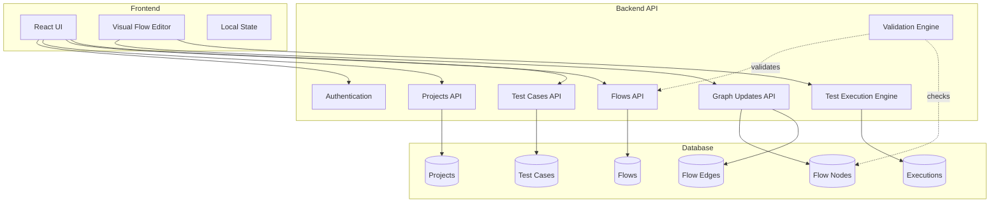
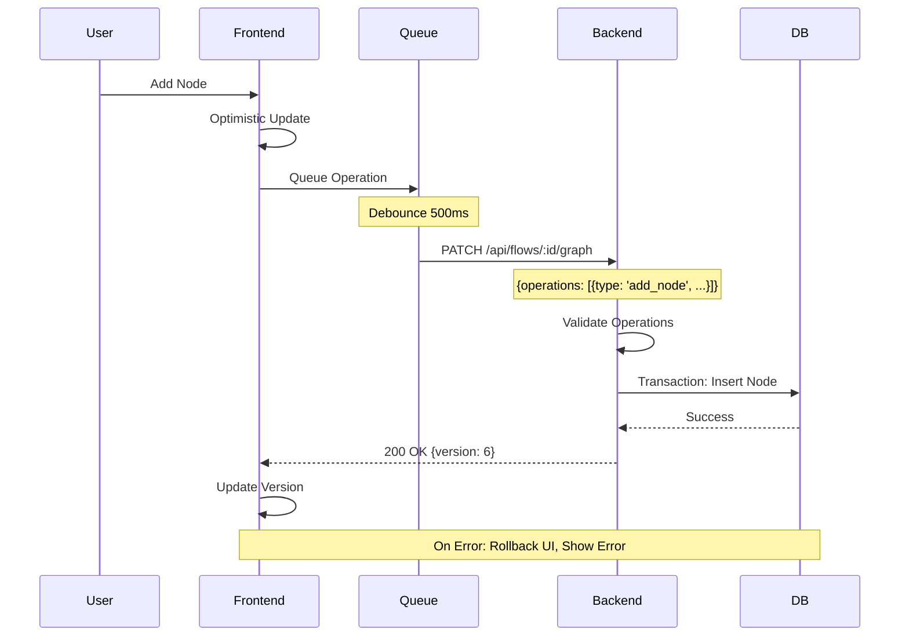
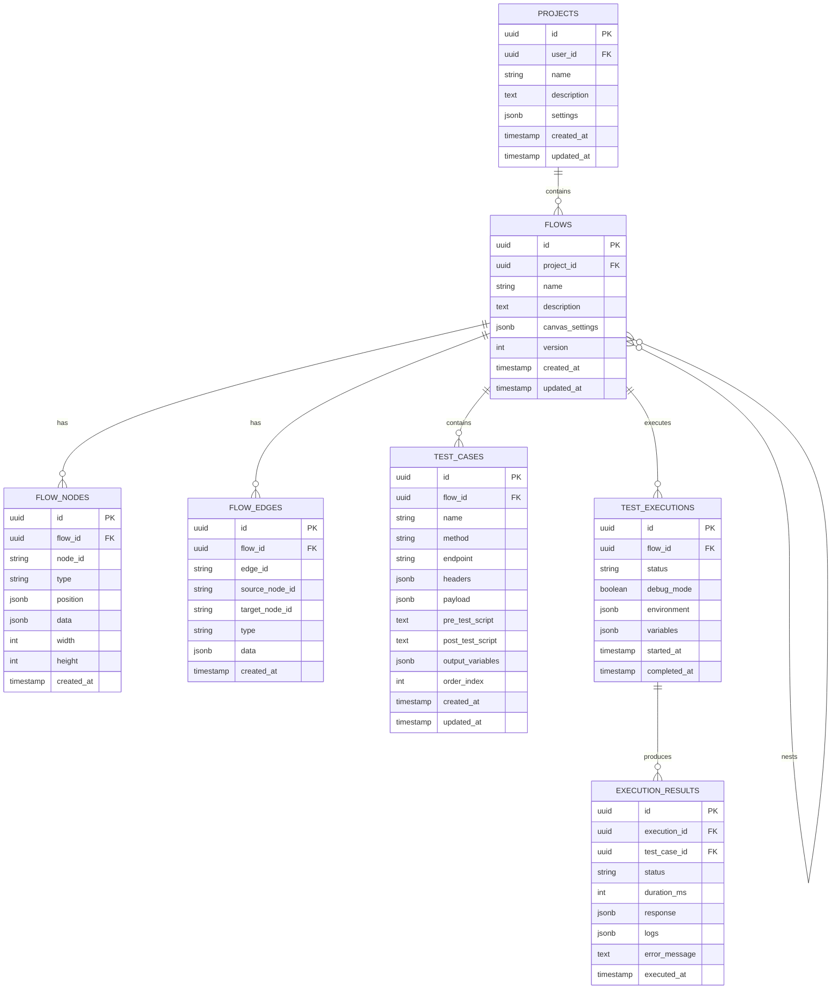
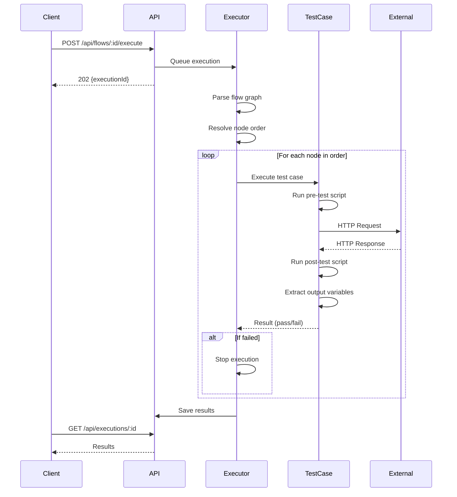

# API Specification - Test Automation Platform

**Version:** 1.0  
**Last Updated:** 2025-11-24  
**Status:** Draft for Backend Implementation

---

## Table of Contents

1. [Overview & Architecture](#overview--architecture)
2. [Data Model & Database Schema](#data-model--database-schema)
3. [API Endpoints](#api-endpoints)
4. [Request/Response Specifications](#requestresponse-specifications)
5. [Validation Rules](#validation-rules)
6. [Error Handling](#error-handling)
7. [Batch Operations Format](#batch-operations-format)
8. [Test Execution Details](#test-execution-details)
9. [Concurrency & Conflict Resolution](#concurrency--conflict-resolution)
10. [Performance Considerations](#performance-considerations)
11. [Testing Scenarios](#testing-scenarios)
12. [Authentication & Authorization](#authentication--authorization)
13. [Migration Path](#migration-path)

---

## Overview & Architecture

### System Description

This is a visual test automation platform that allows users to:
- Create and manage test projects
- Design test flows using a node-based visual editor
- Define API test cases with pre/post scripts
- Execute tests with real-time feedback
- Nest flows within flows for reusable test suites
- Track execution history and results

### Architecture Diagram



### Data Flow: Incremental Updates



### Hybrid Validation Approach

**Frontend Validation (UX):**
- Immediate feedback for user actions
- Prevent circular dependencies before API call
- Real-time flow structure validation
- Optimistic UI updates

**Backend Validation (Security):**
- Authoritative source of truth
- Prevent concurrent modification conflicts
- Enforce business rules and constraints
- Audit trail for all operations

---

## Data Model & Database Schema

### Entity Relationship Diagram



### Database Tables

#### 1. `projects`

```sql
CREATE TABLE projects (
  id UUID PRIMARY KEY DEFAULT gen_random_uuid(),
  user_id UUID NOT NULL REFERENCES auth.users(id) ON DELETE CASCADE,
  name VARCHAR(255) NOT NULL,
  description TEXT,
  settings JSONB DEFAULT '{}',
  created_at TIMESTAMPTZ DEFAULT NOW(),
  updated_at TIMESTAMPTZ DEFAULT NOW(),
  
  CONSTRAINT projects_name_unique UNIQUE (user_id, name)
);

CREATE INDEX idx_projects_user_id ON projects(user_id);
CREATE INDEX idx_projects_created_at ON projects(created_at DESC);
```

#### 2. `flows`

```sql
CREATE TABLE flows (
  id UUID PRIMARY KEY DEFAULT gen_random_uuid(),
  project_id UUID NOT NULL REFERENCES projects(id) ON DELETE CASCADE,
  name VARCHAR(255) NOT NULL,
  description TEXT,
  canvas_settings JSONB DEFAULT '{
    "snapToGrid": false,
    "snapToGridSize": 15,
    "showEdgeLabels": true,
    "layoutDirection": "horizontal"
  }',
  version INT DEFAULT 1,
  created_at TIMESTAMPTZ DEFAULT NOW(),
  updated_at TIMESTAMPTZ DEFAULT NOW(),
  
  CONSTRAINT flows_name_unique UNIQUE (project_id, name)
);

CREATE INDEX idx_flows_project_id ON flows(project_id);
CREATE INDEX idx_flows_updated_at ON flows(updated_at DESC);
```

#### 3. `flow_nodes`

```sql
CREATE TABLE flow_nodes (
  id UUID PRIMARY KEY DEFAULT gen_random_uuid(),
  flow_id UUID NOT NULL REFERENCES flows(id) ON DELETE CASCADE,
  node_id VARCHAR(255) NOT NULL, -- Frontend-generated ID
  type VARCHAR(50) NOT NULL, -- 'start', 'end', 'testCase', 'group'
  position JSONB NOT NULL, -- {x: number, y: number}
  data JSONB NOT NULL, -- Node-specific data
  width INT,
  height INT,
  created_at TIMESTAMPTZ DEFAULT NOW(),
  
  CONSTRAINT flow_nodes_unique UNIQUE (flow_id, node_id)
);

CREATE INDEX idx_flow_nodes_flow_id ON flow_nodes(flow_id);
CREATE INDEX idx_flow_nodes_type ON flow_nodes(type);
```

**Node Data Examples:**

```json
// Start Node
{
  "type": "start",
  "data": {
    "label": "Start"
  }
}

// End Node
{
  "type": "end",
  "data": {
    "label": "End"
  }
}

// Test Case Node
{
  "type": "testCase",
  "data": {
    "testCaseId": "uuid-of-test-case",
    "name": "Login Test",
    "method": "POST",
    "endpoint": "/auth/login"
  }
}

// Group Node (Nested Flow)
{
  "type": "group",
  "data": {
    "groupId": "uuid-of-nested-flow",
    "label": "Authentication Suite",
    "testCaseCount": 5
  }
}
```

#### 4. `flow_edges`

```sql
CREATE TABLE flow_edges (
  id UUID PRIMARY KEY DEFAULT gen_random_uuid(),
  flow_id UUID NOT NULL REFERENCES flows(id) ON DELETE CASCADE,
  edge_id VARCHAR(255) NOT NULL, -- Frontend-generated ID
  source_node_id VARCHAR(255) NOT NULL,
  target_node_id VARCHAR(255) NOT NULL,
  type VARCHAR(50) DEFAULT 'default', -- 'default', 'conditional'
  data JSONB DEFAULT '{}', -- Edge-specific data (labels, conditions)
  created_at TIMESTAMPTZ DEFAULT NOW(),
  
  CONSTRAINT flow_edges_unique UNIQUE (flow_id, edge_id)
);

CREATE INDEX idx_flow_edges_flow_id ON flow_edges(flow_id);
CREATE INDEX idx_flow_edges_source ON flow_edges(flow_id, source_node_id);
CREATE INDEX idx_flow_edges_target ON flow_edges(flow_id, target_node_id);
```

#### 5. `test_cases`

```sql
CREATE TABLE test_cases (
  id UUID PRIMARY KEY DEFAULT gen_random_uuid(),
  flow_id UUID NOT NULL REFERENCES flows(id) ON DELETE CASCADE,
  name VARCHAR(255) NOT NULL,
  method VARCHAR(10) NOT NULL, -- GET, POST, PUT, PATCH, DELETE
  endpoint TEXT NOT NULL,
  headers JSONB DEFAULT '{}',
  payload JSONB,
  pre_test_script TEXT, -- JavaScript code
  post_test_script TEXT, -- JavaScript code
  output_variables JSONB DEFAULT '[]', -- [{name: string, path: string}]
  order_index INT DEFAULT 0,
  created_at TIMESTAMPTZ DEFAULT NOW(),
  updated_at TIMESTAMPTZ DEFAULT NOW()
);

CREATE INDEX idx_test_cases_flow_id ON test_cases(flow_id);
CREATE INDEX idx_test_cases_order ON test_cases(flow_id, order_index);
```

**Test Case Example:**

```json
{
  "name": "Login with Valid Credentials",
  "method": "POST",
  "endpoint": "{{baseUrl}}/auth/login",
  "headers": {
    "Content-Type": "application/json",
    "X-API-Version": "v1"
  },
  "payload": {
    "email": "{{username}}",
    "password": "{{password}}"
  },
  "pre_test_script": "SAT.vars.timestamp = Date.now();",
  "post_test_script": "SAT.assert(response.status === 200, 'Login successful');",
  "output_variables": [
    {"name": "authToken", "path": "response.data.token"},
    {"name": "userId", "path": "response.data.user.id"}
  ]
}
```

#### 6. `test_executions`

```sql
CREATE TABLE test_executions (
  id UUID PRIMARY KEY DEFAULT gen_random_uuid(),
  flow_id UUID NOT NULL REFERENCES flows(id) ON DELETE CASCADE,
  status VARCHAR(20) NOT NULL, -- 'pending', 'running', 'completed', 'failed'
  debug_mode BOOLEAN DEFAULT FALSE,
  environment JSONB DEFAULT '{}', -- {baseUrl, timeout, etc.}
  variables JSONB DEFAULT '{}', -- Initial variables
  started_at TIMESTAMPTZ DEFAULT NOW(),
  completed_at TIMESTAMPTZ,
  
  CHECK (status IN ('pending', 'running', 'completed', 'failed'))
);

CREATE INDEX idx_executions_flow_id ON test_executions(flow_id);
CREATE INDEX idx_executions_status ON test_executions(status);
CREATE INDEX idx_executions_started_at ON test_executions(started_at DESC);
```

#### 7. `execution_results`

```sql
CREATE TABLE execution_results (
  id UUID PRIMARY KEY DEFAULT gen_random_uuid(),
  execution_id UUID NOT NULL REFERENCES test_executions(id) ON DELETE CASCADE,
  test_case_id UUID NOT NULL REFERENCES test_cases(id),
  status VARCHAR(20) NOT NULL, -- 'passed', 'failed', 'skipped'
  duration_ms INT,
  response JSONB, -- Full HTTP response
  logs JSONB DEFAULT '[]', -- Array of log messages
  error_message TEXT,
  executed_at TIMESTAMPTZ DEFAULT NOW(),
  
  CHECK (status IN ('passed', 'failed', 'skipped'))
);

CREATE INDEX idx_execution_results_execution_id ON execution_results(execution_id);
CREATE INDEX idx_execution_results_test_case_id ON execution_results(test_case_id);
CREATE INDEX idx_execution_results_status ON execution_results(status);
```

#### 8. `flow_operations` (Optional - Audit Trail)

```sql
CREATE TABLE flow_operations (
  id UUID PRIMARY KEY DEFAULT gen_random_uuid(),
  flow_id UUID NOT NULL REFERENCES flows(id) ON DELETE CASCADE,
  user_id UUID NOT NULL REFERENCES auth.users(id),
  operation_type VARCHAR(50) NOT NULL,
  operation_data JSONB NOT NULL,
  version_before INT,
  version_after INT,
  created_at TIMESTAMPTZ DEFAULT NOW()
);

CREATE INDEX idx_flow_operations_flow_id ON flow_operations(flow_id);
CREATE INDEX idx_flow_operations_created_at ON flow_operations(created_at DESC);
```

---

## API Endpoints

### Base URL

```
Production: https://api.yourapp.com/v1
Development: http://localhost:3000/v1
```

### Authentication

All endpoints require authentication via JWT token:

```http
Authorization: Bearer <jwt_token>
```

---

### Projects API

#### Create Project

```http
POST /api/projects
```

**Request Body:**

```json
{
  "name": "E-Commerce API Tests",
  "description": "Test suite for e-commerce platform APIs",
  "settings": {
    "timeout": 5000,
    "retryCount": 3
  }
}
```

**Response (201 Created):**

```json
{
  "id": "550e8400-e29b-41d4-a716-446655440000",
  "name": "E-Commerce API Tests",
  "description": "Test suite for e-commerce platform APIs",
  "settings": {
    "timeout": 5000,
    "retryCount": 3
  },
  "createdAt": "2025-11-23T10:30:00Z",
  "updatedAt": "2025-11-23T10:30:00Z"
}
```

**cURL Example:**

```bash
curl -X POST https://api.yourapp.com/v1/api/projects \
  -H "Authorization: Bearer <token>" \
  -H "Content-Type: application/json" \
  -d '{
    "name": "E-Commerce API Tests",
    "description": "Test suite for e-commerce platform APIs"
  }'
```

---

#### List Projects

```http
GET /api/projects?page=1&limit=20&sort=createdAt:desc
```

**Query Parameters:**

| Parameter | Type | Default | Description |
|-----------|------|---------|-------------|
| page | integer | 1 | Page number |
| limit | integer | 20 | Items per page |
| sort | string | createdAt:desc | Sort field and order |
| search | string | - | Search in name/description |

**Response (200 OK):**

```json
{
  "data": [
    {
      "id": "550e8400-e29b-41d4-a716-446655440000",
      "name": "E-Commerce API Tests",
      "description": "Test suite for e-commerce platform APIs",
      "flowCount": 5,
      "testCount": 23,
      "createdAt": "2025-11-23T10:30:00Z",
      "updatedAt": "2025-11-23T10:30:00Z"
    }
  ],
  "pagination": {
    "page": 1,
    "limit": 20,
    "total": 45,
    "totalPages": 3
  }
}
```

---

#### Get Single Project

```http
GET /api/projects/:projectId
```

**Response (200 OK):**

```json
{
  "id": "550e8400-e29b-41d4-a716-446655440000",
  "name": "E-Commerce API Tests",
  "description": "Test suite for e-commerce platform APIs",
  "settings": {
    "timeout": 5000,
    "retryCount": 3
  },
  "flows": [
    {
      "id": "flow-uuid-1",
      "name": "Authentication Flow",
      "testCaseCount": 5
    },
    {
      "id": "flow-uuid-2",
      "name": "Checkout Flow",
      "testCaseCount": 8
    }
  ],
  "createdAt": "2025-11-23T10:30:00Z",
  "updatedAt": "2025-11-23T10:30:00Z"
}
```

---

#### Update Project

```http
PATCH /api/projects/:projectId
```

**Request Body:**

```json
{
  "name": "Updated Project Name",
  "description": "Updated description",
  "settings": {
    "timeout": 8000
  }
}
```

**Response (200 OK):**

```json
{
  "id": "550e8400-e29b-41d4-a716-446655440000",
  "name": "Updated Project Name",
  "description": "Updated description",
  "settings": {
    "timeout": 8000,
    "retryCount": 3
  },
  "updatedAt": "2025-11-23T11:00:00Z"
}
```

---

#### Delete Project

```http
DELETE /api/projects/:projectId
```

**Response (204 No Content)**

**Note:** Cascades to delete all flows, test cases, nodes, edges, and executions.

---

### Flows API

#### Create Flow

```http
POST /api/projects/:projectId/flows
```

**Request Body:**

```json
{
  "name": "Authentication Flow",
  "description": "Tests for login, logout, and token refresh",
  "canvasSettings": {
    "snapToGrid": true,
    "snapToGridSize": 15,
    "showEdgeLabels": true,
    "layoutDirection": "horizontal"
  }
}
```

**Response (201 Created):**

```json
{
  "id": "flow-uuid-123",
  "projectId": "550e8400-e29b-41d4-a716-446655440000",
  "name": "Authentication Flow",
  "description": "Tests for login, logout, and token refresh",
  "canvasSettings": {
    "snapToGrid": true,
    "snapToGridSize": 15,
    "showEdgeLabels": true,
    "layoutDirection": "horizontal"
  },
  "version": 1,
  "createdAt": "2025-11-23T10:30:00Z",
  "updatedAt": "2025-11-23T10:30:00Z"
}
```

---

#### List Flows in Project

```http
GET /api/projects/:projectId/flows
```

**Response (200 OK):**

```json
{
  "data": [
    {
      "id": "flow-uuid-123",
      "name": "Authentication Flow",
      "description": "Tests for login, logout, and token refresh",
      "testCaseCount": 5,
      "nodeCount": 8,
      "version": 3,
      "updatedAt": "2025-11-23T10:30:00Z"
    }
  ]
}
```

---

#### Get Flow with Full Graph

```http
GET /api/flows/:flowId
```

**Response (200 OK):**

```json
{
  "id": "flow-uuid-123",
  "projectId": "550e8400-e29b-41d4-a716-446655440000",
  "name": "Authentication Flow",
  "description": "Tests for login, logout, and token refresh",
  "canvasSettings": {
    "snapToGrid": true,
    "snapToGridSize": 15,
    "showEdgeLabels": true
  },
  "version": 5,
  "nodes": [
    {
      "id": "node-start-1",
      "type": "start",
      "position": {"x": 100, "y": 200},
      "data": {"label": "Start"}
    },
    {
      "id": "node-test-1",
      "type": "testCase",
      "position": {"x": 300, "y": 200},
      "data": {
        "testCaseId": "test-uuid-1",
        "name": "Login Test",
        "method": "POST",
        "endpoint": "/auth/login"
      }
    },
    {
      "id": "node-end-1",
      "type": "end",
      "position": {"x": 500, "y": 200},
      "data": {"label": "End"}
    }
  ],
  "edges": [
    {
      "id": "edge-1",
      "source": "node-start-1",
      "target": "node-test-1",
      "type": "default"
    },
    {
      "id": "edge-2",
      "source": "node-test-1",
      "target": "node-end-1",
      "type": "default"
    }
  ],
  "updatedAt": "2025-11-23T10:30:00Z"
}
```

---

#### Update Flow Metadata

```http
PATCH /api/flows/:flowId
```

**Request Body:**

```json
{
  "name": "Updated Flow Name",
  "description": "Updated description",
  "canvasSettings": {
    "snapToGrid": false
  }
}
```

**Response (200 OK):**

```json
{
  "id": "flow-uuid-123",
  "name": "Updated Flow Name",
  "description": "Updated description",
  "version": 5,
  "updatedAt": "2025-11-23T11:00:00Z"
}
```

---

#### Delete Flow

```http
DELETE /api/flows/:flowId
```

**Response (204 No Content)**

---

#### Get Available Flows for Nesting

```http
GET /api/flows/:flowId/available-flows
```

Returns flows that can be safely nested in the current flow without creating circular dependencies.

**Response (200 OK):**

```json
{
  "data": [
    {
      "id": "flow-uuid-456",
      "name": "Token Refresh Flow",
      "testCaseCount": 2
    },
    {
      "id": "flow-uuid-789",
      "name": "Logout Flow",
      "testCaseCount": 1
    }
  ]
}
```

**Note:** This endpoint performs circular dependency checks and excludes:
- The current flow itself
- Any flows that already contain the current flow
- Any flows that would create a circular dependency chain

---

### Test Cases API

#### Create Test Case

```http
POST /api/flows/:flowId/test-cases
```

**Request Body:**

```json
{
  "name": "Login with Valid Credentials",
  "method": "POST",
  "endpoint": "{{baseUrl}}/auth/login",
  "headers": {
    "Content-Type": "application/json"
  },
  "payload": {
    "email": "{{username}}",
    "password": "{{password}}"
  },
  "preTestScript": "SAT.vars.timestamp = Date.now();",
  "postTestScript": "SAT.assert(response.status === 200, 'Login successful');",
  "outputVariables": [
    {"name": "authToken", "path": "response.data.token"}
  ],
  "orderIndex": 0
}
```

**Response (201 Created):**

```json
{
  "id": "test-uuid-123",
  "flowId": "flow-uuid-123",
  "name": "Login with Valid Credentials",
  "method": "POST",
  "endpoint": "{{baseUrl}}/auth/login",
  "headers": {
    "Content-Type": "application/json"
  },
  "payload": {
    "email": "{{username}}",
    "password": "{{password}}"
  },
  "preTestScript": "SAT.vars.timestamp = Date.now();",
  "postTestScript": "SAT.assert(response.status === 200, 'Login successful');",
  "outputVariables": [
    {"name": "authToken", "path": "response.data.token"}
  ],
  "orderIndex": 0,
  "createdAt": "2025-11-23T10:30:00Z",
  "updatedAt": "2025-11-23T10:30:00Z"
}
```

---

#### List Test Cases in Flow

```http
GET /api/flows/:flowId/test-cases
```

**Response (200 OK):**

```json
{
  "data": [
    {
      "id": "test-uuid-123",
      "name": "Login with Valid Credentials",
      "method": "POST",
      "endpoint": "{{baseUrl}}/auth/login",
      "orderIndex": 0
    },
    {
      "id": "test-uuid-124",
      "name": "Login with Invalid Credentials",
      "method": "POST",
      "endpoint": "{{baseUrl}}/auth/login",
      "orderIndex": 1
    }
  ]
}
```

---

#### Get Single Test Case

```http
GET /api/test-cases/:testCaseId
```

**Response (200 OK):**

```json
{
  "id": "test-uuid-123",
  "flowId": "flow-uuid-123",
  "name": "Login with Valid Credentials",
  "method": "POST",
  "endpoint": "{{baseUrl}}/auth/login",
  "headers": {
    "Content-Type": "application/json"
  },
  "payload": {
    "email": "{{username}}",
    "password": "{{password}}"
  },
  "preTestScript": "SAT.vars.timestamp = Date.now();",
  "postTestScript": "SAT.assert(response.status === 200, 'Login successful');",
  "outputVariables": [
    {"name": "authToken", "path": "response.data.token"}
  ],
  "createdAt": "2025-11-23T10:30:00Z",
  "updatedAt": "2025-11-23T10:30:00Z"
}
```

---

#### Update Test Case

```http
PATCH /api/test-cases/:testCaseId
```

**Request Body:**

```json
{
  "name": "Updated Test Name",
  "endpoint": "{{baseUrl}}/v2/auth/login",
  "headers": {
    "X-API-Version": "v2"
  }
}
```

**Response (200 OK):**

```json
{
  "id": "test-uuid-123",
  "name": "Updated Test Name",
  "endpoint": "{{baseUrl}}/v2/auth/login",
  "updatedAt": "2025-11-23T11:00:00Z"
}
```

---

#### Delete Test Case

```http
DELETE /api/test-cases/:testCaseId
```

**Response (204 No Content)**

---

### Incremental Graph Updates

#### Batch Update Nodes and Edges

```http
PATCH /api/flows/:flowId/graph
```

This endpoint supports batching multiple operations in a single request for optimal performance.

**Request Body:**

```json
{
  "version": 5,
  "operations": [
    {
      "type": "add_node",
      "data": {
        "id": "node-test-2",
        "type": "testCase",
        "position": {"x": 400, "y": 200},
        "data": {
          "testCaseId": "test-uuid-2",
          "name": "Logout Test",
          "method": "POST",
          "endpoint": "/auth/logout"
        }
      }
    },
    {
      "type": "add_edge",
      "data": {
        "id": "edge-3",
        "source": "node-test-1",
        "target": "node-test-2",
        "type": "default"
      }
    },
    {
      "type": "update_node",
      "data": {
        "id": "node-test-1",
        "position": {"x": 300, "y": 250}
      }
    },
    {
      "type": "delete_node",
      "data": {
        "id": "node-old-1"
      }
    },
    {
      "type": "delete_edge",
      "data": {
        "id": "edge-old-1"
      }
    }
  ]
}
```

**Operation Types:**

| Type | Description | Required Fields |
|------|-------------|-----------------|
| `add_node` | Add new node | `id`, `type`, `position`, `data` |
| `update_node` | Update existing node | `id`, plus fields to update |
| `delete_node` | Remove node | `id` |
| `add_edge` | Add new edge | `id`, `source`, `target`, `type` |
| `update_edge` | Update existing edge | `id`, plus fields to update |
| `delete_edge` | Remove edge | `id` |

**Response (200 OK):**

```json
{
  "success": true,
  "version": 6,
  "appliedOperations": 5,
  "updatedAt": "2025-11-23T10:31:00Z"
}
```

**Response (409 Conflict - Version Mismatch):**

```json
{
  "error": {
    "code": "CONCURRENT_MODIFICATION",
    "message": "Flow was modified by another user. Please refresh and try again.",
    "details": {
      "clientVersion": 5,
      "serverVersion": 7
    }
  }
}
```

**cURL Example:**

```bash
curl -X PATCH https://api.yourapp.com/v1/api/flows/flow-uuid-123/graph \
  -H "Authorization: Bearer <token>" \
  -H "Content-Type: application/json" \
  -d '{
    "version": 5,
    "operations": [
      {
        "type": "add_node",
        "data": {
          "id": "node-test-2",
          "type": "testCase",
          "position": {"x": 400, "y": 200},
          "data": {"testCaseId": "test-uuid-2", "name": "Logout Test"}
        }
      }
    ]
  }'
```

---

#### Full State Checkpoint

```http
POST /api/flows/:flowId/checkpoint
```

Save complete flow state as a safety net. Use sparingly (e.g., every 5 minutes, on page unload).

**Request Body:**

```json
{
  "nodes": [
    {
      "id": "node-start-1",
      "type": "start",
      "position": {"x": 100, "y": 200},
      "data": {"label": "Start"}
    }
  ],
  "edges": [
    {
      "id": "edge-1",
      "source": "node-start-1",
      "target": "node-test-1",
      "type": "default"
    }
  ],
  "canvasSettings": {
    "snapToGrid": true
  }
}
```

**Response (200 OK):**

```json
{
  "success": true,
  "version": 6,
  "checkpointedAt": "2025-11-23T10:35:00Z"
}
```

---

### Test Execution API

#### Execute Flow

```http
POST /api/flows/:flowId/execute?debug=true
```

**Query Parameters:**

| Parameter | Type | Default | Description |
|-----------|------|---------|-------------|
| debug | boolean | false | Enable verbose logging |

**Request Body:**

```json
{
  "environment": {
    "baseUrl": "https://api.example.com",
    "timeout": 5000
  },
  "variables": {
    "username": "test@example.com",
    "password": "secret123",
    "apiKey": "key-12345"
  }
}
```

**Response (202 Accepted):**

```json
{
  "executionId": "exec-uuid-123",
  "status": "pending",
  "flowId": "flow-uuid-123",
  "startedAt": "2025-11-23T10:30:00Z"
}
```

**TypeScript Example:**

```typescript
const response = await fetch(
  `https://api.yourapp.com/v1/api/flows/${flowId}/execute?debug=true`,
  {
    method: 'POST',
    headers: {
      'Authorization': `Bearer ${token}`,
      'Content-Type': 'application/json'
    },
    body: JSON.stringify({
      environment: {
        baseUrl: 'https://api.example.com',
        timeout: 5000
      },
      variables: {
        username: 'test@example.com',
        password: 'secret123'
      }
    })
  }
);

const { executionId } = await response.json();

// Poll for results
const pollResults = async () => {
  const res = await fetch(
    `https://api.yourapp.com/v1/api/executions/${executionId}`,
    {
      headers: { 'Authorization': `Bearer ${token}` }
    }
  );
  return res.json();
};
```

---

#### Get Execution Results

```http
GET /api/executions/:executionId
```

**Response (200 OK - Running):**

```json
{
  "id": "exec-uuid-123",
  "flowId": "flow-uuid-123",
  "status": "running",
  "startedAt": "2025-11-23T10:30:00Z",
  "progress": {
    "total": 10,
    "completed": 3,
    "current": "Login Test"
  }
}
```

**Response (200 OK - Completed):**

```json
{
  "id": "exec-uuid-123",
  "flowId": "flow-uuid-123",
  "status": "completed",
  "debugMode": true,
  "startedAt": "2025-11-23T10:30:00Z",
  "completedAt": "2025-11-23T10:30:15Z",
  "duration": 15000,
  "summary": {
    "total": 10,
    "passed": 8,
    "failed": 2,
    "skipped": 0
  },
  "results": [
    {
      "testCaseId": "test-uuid-1",
      "testCaseName": "Login with Valid Credentials",
      "status": "passed",
      "duration": 201,
      "response": {
        "status": 200,
        "statusText": "OK",
        "headers": {
          "content-type": "application/json"
        },
        "data": {
          "token": "eyJhbGc...",
          "user": {
            "id": "user-123",
            "email": "test@example.com"
          }
        }
      },
      "logs": [
        "[10:30:00.123] Pre-test script executed",
        "[10:30:00.324] Request sent: POST /auth/login",
        "[10:30:00.525] Response received: 200 OK",
        "[10:30:00.526] Post-test assertion passed",
        "[10:30:00.527] Output variable 'authToken' saved"
      ],
      "variables": {
        "authToken": "eyJhbGc...",
        "userId": "user-123"
      }
    },
    {
      "testCaseId": "test-uuid-2",
      "testCaseName": "Get User Profile",
      "status": "failed",
      "duration": 152,
      "response": {
        "status": 401,
        "statusText": "Unauthorized",
        "data": {
          "error": "Invalid token"
        }
      },
      "logs": [
        "[10:30:01.000] Request sent: GET /users/profile",
        "[10:30:01.152] Response received: 401 Unauthorized",
        "[10:30:01.153] Assertion failed: Expected 200, got 401"
      ],
      "errorMessage": "Assertion failed: Expected status 200, got 401"
    }
  ]
}
```

---

#### Get Execution Logs (Streaming)

```http
GET /api/executions/:executionId/logs
```

**Response (200 OK - Server-Sent Events):**

```
event: log
data: {"timestamp": "2025-11-23T10:30:00.123Z", "level": "info", "message": "Starting execution"}

event: log
data: {"timestamp": "2025-11-23T10:30:00.324Z", "level": "info", "message": "Executing test: Login Test"}

event: log
data: {"timestamp": "2025-11-23T10:30:00.525Z", "level": "success", "message": "Test passed: Login Test"}

event: complete
data: {"status": "completed", "duration": 15000}
```

---

### Validation API

#### Validate Flow Structure

```http
POST /api/flows/:flowId/validate
```

**Response (200 OK - Valid):**

```json
{
  "valid": true,
  "message": "Flow structure is valid"
}
```

**Response (400 Bad Request - Invalid):**

```json
{
  "valid": false,
  "errors": [
    {
      "code": "MISSING_START_NODE",
      "message": "Flow must have exactly one Start node"
    },
    {
      "code": "ORPHANED_NODES",
      "message": "Found 2 orphaned nodes",
      "details": {
        "nodeIds": ["node-test-5", "node-test-6"]
      }
    },
    {
      "code": "INVALID_EDGE",
      "message": "Edge connects to non-existent node",
      "details": {
        "edgeId": "edge-99",
        "targetNodeId": "node-missing"
      }
    }
  ]
}
```

---

#### Validate Nesting (Circular Dependency Check)

```http
POST /api/flows/:flowId/validate-nesting
```

**Request Body:**

```json
{
  "targetFlowId": "flow-uuid-456"
}
```

**Response (200 OK - Safe to Nest):**

```json
{
  "valid": true,
  "message": "Flow can be safely nested"
}
```

**Response (400 Bad Request - Circular Dependency):**

```json
{
  "valid": false,
  "error": {
    "code": "CIRCULAR_DEPENDENCY",
    "message": "Cannot add flow 'Checkout Flow' to 'Authentication Flow' because it would create a circular dependency",
    "details": {
      "currentFlowId": "flow-uuid-123",
      "currentFlowName": "Authentication Flow",
      "targetFlowId": "flow-uuid-456",
      "targetFlowName": "Checkout Flow",
      "dependencyChain": [
        {"id": "flow-uuid-123", "name": "Authentication Flow"},
        {"id": "flow-uuid-456", "name": "Checkout Flow"},
        {"id": "flow-uuid-789", "name": "Payment Flow"},
        {"id": "flow-uuid-123", "name": "Authentication Flow"}
      ]
    }
  }
}
```

---

## Validation Rules

### Circular Dependency Detection

**Algorithm (Pseudocode):**

```typescript
/**
 * Check if adding targetFlow to currentFlow would create a circular dependency
 */
function hasCircularDependency(
  currentFlowId: string,
  targetFlowId: string,
  visited: Set<string> = new Set()
): boolean {
  // Direct self-reference
  if (currentFlowId === targetFlowId) {
    return true;
  }

  // Already checked this flow in this path
  if (visited.has(targetFlowId)) {
    return false;
  }

  // Mark as visited
  visited.add(targetFlowId);

  // Get the target flow's nodes
  const targetFlow = getFlow(targetFlowId);
  
  // Find all nested flow nodes (type === 'group')
  const nestedFlowNodes = targetFlow.nodes.filter(
    node => node.type === 'group'
  );

  // Recursively check each nested flow
  for (const node of nestedFlowNodes) {
    const nestedFlowId = node.data.groupId;
    
    if (hasCircularDependency(currentFlowId, nestedFlowId, visited)) {
      return true;
    }
  }

  return false;
}

/**
 * Usage example
 */
function validateFlowNesting(currentFlowId: string, targetFlowId: string) {
  if (hasCircularDependency(currentFlowId, targetFlowId)) {
    throw new Error({
      code: 'CIRCULAR_DEPENDENCY',
      message: 'Cannot nest flow: circular dependency detected'
    });
  }
}
```

**Examples:**

✅ **Allowed:**
```
Flow A → Flow B → Flow C
(A contains B, B contains C, no cycles)
```

❌ **Blocked - Direct Self-Reference:**
```
Flow A → Flow A
(Cannot add A to itself)
```

❌ **Blocked - Two-Level Cycle:**
```
Flow A → Flow B
Then try to add: Flow B → Flow A
(Creates cycle: A → B → A)
```

❌ **Blocked - Multi-Level Cycle:**
```
Flow A → Flow B → Flow C
Then try to add: Flow C → Flow A
(Creates cycle: A → B → C → A)
```

✅ **Allowed - Diamond Pattern:**
```
     Flow A
    /      \
Flow B    Flow C
    \      /
     Flow D
(No cycles, both B and C can contain D)
```

### Flow Structure Validation

**Required Rules:**

1. **Start Node:**
   - Must have exactly one node with `type === 'start'`
   - Must be present in every flow

2. **End Node:**
   - Must have at least one node with `type === 'end'`
   - Can have multiple end nodes for different paths

3. **No Orphaned Nodes:**
   - Every node (except start/end) must be reachable from start
   - Every node (except start/end) must have a path to end
   - Exception: Start and End nodes can be isolated

4. **Valid Edges:**
   - Source and target nodes must exist
   - Cannot have edges from End nodes
   - Cannot have edges to Start nodes

5. **Test Case References:**
   - Nodes with `type === 'testCase'` must reference existing test cases
   - Test case IDs must be valid UUIDs in the database

6. **Group Node References:**
   - Nodes with `type === 'group'` must reference existing flows
   - Must pass circular dependency validation

**Validation Function (Pseudocode):**

```typescript
function validateFlowStructure(flow: Flow): ValidationResult {
  const errors: ValidationError[] = [];

  // Check start nodes
  const startNodes = flow.nodes.filter(n => n.type === 'start');
  if (startNodes.length === 0) {
    errors.push({
      code: 'MISSING_START_NODE',
      message: 'Flow must have exactly one Start node'
    });
  } else if (startNodes.length > 1) {
    errors.push({
      code: 'MULTIPLE_START_NODES',
      message: 'Flow can only have one Start node'
    });
  }

  // Check end nodes
  const endNodes = flow.nodes.filter(n => n.type === 'end');
  if (endNodes.length === 0) {
    errors.push({
      code: 'MISSING_END_NODE',
      message: 'Flow must have at least one End node'
    });
  }

  // Check for orphaned nodes
  const reachableFromStart = findReachableNodes(flow, startNodes[0]?.id);
  const reachableToEnd = findNodesWithPathToEnd(flow, endNodes.map(n => n.id));
  
  const orphanedNodes = flow.nodes.filter(node => {
    if (node.type === 'start' || node.type === 'end') return false;
    return !reachableFromStart.has(node.id) || !reachableToEnd.has(node.id);
  });

  if (orphanedNodes.length > 0) {
    errors.push({
      code: 'ORPHANED_NODES',
      message: `Found ${orphanedNodes.length} orphaned nodes`,
      details: { nodeIds: orphanedNodes.map(n => n.id) }
    });
  }

  // Validate edges
  const nodeIds = new Set(flow.nodes.map(n => n.id));
  
  for (const edge of flow.edges) {
    if (!nodeIds.has(edge.source)) {
      errors.push({
        code: 'INVALID_EDGE',
        message: 'Edge source node does not exist',
        details: { edgeId: edge.id, sourceNodeId: edge.source }
      });
    }
    
    if (!nodeIds.has(edge.target)) {
      errors.push({
        code: 'INVALID_EDGE',
        message: 'Edge target node does not exist',
        details: { edgeId: edge.id, targetNodeId: edge.target }
      });
    }
  }

  // Validate test case references
  for (const node of flow.nodes) {
    if (node.type === 'testCase') {
      const testCaseExists = checkTestCaseExists(node.data.testCaseId);
      if (!testCaseExists) {
        errors.push({
          code: 'INVALID_TEST_CASE_REFERENCE',
          message: 'Referenced test case does not exist',
          details: { nodeId: node.id, testCaseId: node.data.testCaseId }
        });
      }
    }
  }

  return {
    valid: errors.length === 0,
    errors
  };
}
```

---

## Error Handling

### Standard Error Response Format

All error responses follow this structure:

```json
{
  "error": {
    "code": "ERROR_CODE",
    "message": "Human-readable error message",
    "details": {
      // Additional context (optional)
    },
    "timestamp": "2025-11-23T10:30:00Z"
  }
}
```

### HTTP Status Codes

| Status Code | Description | When to Use |
|-------------|-------------|-------------|
| 200 OK | Success | Successful GET, PATCH requests |
| 201 Created | Resource created | Successful POST requests |
| 204 No Content | Success with no body | Successful DELETE requests |
| 400 Bad Request | Invalid input | Validation errors, malformed requests |
| 401 Unauthorized | Auth required | Missing or invalid JWT token |
| 403 Forbidden | No permission | User lacks permission for resource |
| 404 Not Found | Resource missing | Entity doesn't exist |
| 409 Conflict | State conflict | Concurrent modification, circular dependency |
| 422 Unprocessable Entity | Semantic errors | Business logic validation failures |
| 500 Internal Server Error | Server error | Unexpected server failures |

### Error Codes

#### Validation Errors (400)

```json
{
  "error": {
    "code": "VALIDATION_FAILED",
    "message": "Request validation failed",
    "details": {
      "fields": {
        "name": "Name is required",
        "endpoint": "Invalid URL format"
      }
    }
  }
}
```

#### Circular Dependency (409)

```json
{
  "error": {
    "code": "CIRCULAR_DEPENDENCY",
    "message": "Cannot add flow 'B' to flow 'A' because it would create a circular dependency",
    "details": {
      "currentFlowId": "flow-uuid-123",
      "currentFlowName": "Flow A",
      "targetFlowId": "flow-uuid-456",
      "targetFlowName": "Flow B",
      "dependencyChain": [
        {"id": "flow-uuid-123", "name": "Flow A"},
        {"id": "flow-uuid-456", "name": "Flow B"},
        {"id": "flow-uuid-123", "name": "Flow A"}
      ]
    }
  }
}
```

#### Concurrent Modification (409)

```json
{
  "error": {
    "code": "CONCURRENT_MODIFICATION",
    "message": "Flow was modified by another user. Please refresh and try again.",
    "details": {
      "clientVersion": 5,
      "serverVersion": 7,
      "lastModifiedBy": "user@example.com",
      "lastModifiedAt": "2025-11-23T10:29:50Z"
    }
  }
}
```

#### Resource Not Found (404)

```json
{
  "error": {
    "code": "RESOURCE_NOT_FOUND",
    "message": "Flow not found",
    "details": {
      "resourceType": "flow",
      "resourceId": "flow-uuid-999"
    }
  }
}
```

#### Invalid Flow Structure (400)

```json
{
  "error": {
    "code": "INVALID_FLOW_STRUCTURE",
    "message": "Flow structure validation failed",
    "details": {
      "errors": [
        {
          "code": "MISSING_START_NODE",
          "message": "Flow must have exactly one Start node"
        },
        {
          "code": "ORPHANED_NODES",
          "message": "Found 2 orphaned nodes",
          "nodeIds": ["node-123", "node-456"]
        }
      ]
    }
  }
}
```

#### Execution Failed (422)

```json
{
  "error": {
    "code": "EXECUTION_FAILED",
    "message": "Test execution failed",
    "details": {
      "executionId": "exec-uuid-123",
      "failedAt": "test-uuid-5",
      "reason": "Network timeout after 5000ms"
    }
  }
}
```

### Error Code Reference

| Error Code | HTTP Status | Description |
|------------|-------------|-------------|
| `VALIDATION_FAILED` | 400 | Request validation errors |
| `INVALID_INPUT` | 400 | Malformed or invalid input data |
| `INVALID_FLOW_STRUCTURE` | 400 | Flow doesn't meet structural requirements |
| `MISSING_START_NODE` | 400 | Flow has no start node |
| `MULTIPLE_START_NODES` | 400 | Flow has more than one start node |
| `MISSING_END_NODE` | 400 | Flow has no end nodes |
| `ORPHANED_NODES` | 400 | Nodes not connected to flow path |
| `INVALID_EDGE` | 400 | Edge references non-existent nodes |
| `INVALID_TEST_CASE_REFERENCE` | 400 | Node references non-existent test case |
| `UNAUTHORIZED` | 401 | Missing or invalid authentication |
| `FORBIDDEN` | 403 | User lacks permission |
| `RESOURCE_NOT_FOUND` | 404 | Requested entity doesn't exist |
| `CIRCULAR_DEPENDENCY` | 409 | Operation would create circular dependency |
| `CONCURRENT_MODIFICATION` | 409 | Version conflict (optimistic locking) |
| `DUPLICATE_RESOURCE` | 409 | Resource with name/identifier already exists |
| `EXECUTION_FAILED` | 422 | Test execution encountered an error |
| `INTERNAL_ERROR` | 500 | Unexpected server error |

---

## Batch Operations Format

### Operations Structure

All batch operations follow this format:

```json
{
  "version": 5,
  "operations": [
    { "type": "operation_type", "data": { ... } }
  ]
}
```

### Supported Operations

#### Add Node

```json
{
  "type": "add_node",
  "data": {
    "id": "node-123",
    "type": "testCase",
    "position": { "x": 100, "y": 200 },
    "data": {
      "testCaseId": "test-uuid-123",
      "name": "Login Test",
      "method": "POST",
      "endpoint": "/auth/login"
    },
    "width": 250,
    "height": 80
  }
}
```

#### Update Node

```json
{
  "type": "update_node",
  "data": {
    "id": "node-123",
    "position": { "x": 150, "y": 220 },
    "data": {
      "name": "Updated Login Test"
    }
  }
}
```

**Note:** Only provided fields are updated (partial update).

#### Delete Node

```json
{
  "type": "delete_node",
  "data": {
    "id": "node-123"
  }
}
```

**Note:** Deleting a node also deletes all connected edges.

#### Add Edge

```json
{
  "type": "add_edge",
  "data": {
    "id": "edge-456",
    "source": "node-123",
    "target": "node-789",
    "type": "default",
    "data": {
      "label": "Success"
    }
  }
}
```

#### Update Edge

```json
{
  "type": "update_edge",
  "data": {
    "id": "edge-456",
    "type": "conditional",
    "data": {
      "label": "If status === 200"
    }
  }
}
```

#### Delete Edge

```json
{
  "type": "delete_edge",
  "data": {
    "id": "edge-456"
  }
}
```

### Transaction Semantics

**Atomic Operations:**
- All operations in a batch are executed within a database transaction
- If any operation fails, all operations are rolled back
- Client must retry the entire batch

**Operation Order:**
- Operations are executed in the order provided
- Dependencies between operations are respected
  - Example: Can't add edge before adding both nodes

**Version Checking:**
- Version is checked before any operations execute
- If version mismatch, entire batch is rejected with `409 Conflict`

**Example Full Batch:**

```json
{
  "version": 5,
  "operations": [
    {
      "type": "add_node",
      "data": {
        "id": "node-new-1",
        "type": "testCase",
        "position": { "x": 400, "y": 200 },
        "data": { "testCaseId": "test-uuid-10", "name": "New Test" }
      }
    },
    {
      "type": "add_edge",
      "data": {
        "id": "edge-new-1",
        "source": "node-existing-5",
        "target": "node-new-1",
        "type": "default"
      }
    },
    {
      "type": "update_node",
      "data": {
        "id": "node-existing-3",
        "position": { "x": 300, "y": 250 }
      }
    },
    {
      "type": "delete_node",
      "data": { "id": "node-old-7" }
    }
  ]
}
```

---

## Test Execution Details

### Execution Flow



### Execution Request

```json
{
  "environment": {
    "baseUrl": "https://api.example.com",
    "timeout": 5000,
    "headers": {
      "X-API-Key": "global-api-key"
    }
  },
  "variables": {
    "username": "test@example.com",
    "password": "secret123",
    "apiKey": "user-specific-key"
  }
}
```

### Variable Scoping

**Global Variables:**
- Defined in `environment` object
- Available to all test cases
- Cannot be overwritten by test cases

**Test Variables:**
- Defined in `variables` object
- Can be overwritten by test output variables
- Scoped to current execution

**Output Variables:**
- Extracted from test responses using JSONPath
- Available to downstream tests in the flow
- Defined in test case configuration

**Example:**

```json
// Test Case 1: Login
{
  "outputVariables": [
    {"name": "authToken", "path": "response.data.token"},
    {"name": "userId", "path": "response.data.user.id"}
  ]
}

// Test Case 2: Get Profile (uses authToken from Test Case 1)
{
  "headers": {
    "Authorization": "Bearer {{authToken}}"
  },
  "endpoint": "{{baseUrl}}/users/{{userId}}/profile"
}
```

### Debug Mode

When `?debug=true` is set:

**Additional Logging:**
- Request headers and body (sanitized)
- Response headers and body
- Script execution logs
- Variable resolution logs
- Timing information for each step

**Log Format:**

```json
{
  "logs": [
    {
      "timestamp": "2025-11-23T10:30:00.123Z",
      "level": "info",
      "message": "Starting test: Login Test"
    },
    {
      "timestamp": "2025-11-23T10:30:00.125Z",
      "level": "debug",
      "message": "Pre-test script executed",
      "data": { "variables": { "timestamp": 1700738400125 } }
    },
    {
      "timestamp": "2025-11-23T10:30:00.127Z",
      "level": "debug",
      "message": "Request prepared",
      "data": {
        "method": "POST",
        "url": "https://api.example.com/auth/login",
        "headers": { "Content-Type": "application/json" },
        "body": { "email": "test@example.com", "password": "***" }
      }
    },
    {
      "timestamp": "2025-11-23T10:30:00.328Z",
      "level": "info",
      "message": "Response received",
      "data": {
        "status": 200,
        "duration": 201
      }
    },
    {
      "timestamp": "2025-11-23T10:30:00.329Z",
      "level": "success",
      "message": "Assertion passed: Status is 200"
    },
    {
      "timestamp": "2025-11-23T10:30:00.330Z",
      "level": "info",
      "message": "Output variable 'authToken' saved"
    }
  ]
}
```

### Execution Result Schema

```typescript
interface ExecutionResult {
  id: string;
  flowId: string;
  status: 'pending' | 'running' | 'completed' | 'failed';
  debugMode: boolean;
  startedAt: string; // ISO 8601
  completedAt?: string; // ISO 8601
  duration?: number; // milliseconds
  summary: {
    total: number;
    passed: number;
    failed: number;
    skipped: number;
  };
  results: TestCaseResult[];
}

interface TestCaseResult {
  testCaseId: string;
  testCaseName: string;
  status: 'passed' | 'failed' | 'skipped';
  duration: number; // milliseconds
  response?: {
    status: number;
    statusText: string;
    headers: Record<string, string>;
    data: any;
  };
  logs: string[];
  variables?: Record<string, any>; // Output variables
  errorMessage?: string;
}
```

---

## Concurrency & Conflict Resolution

### Optimistic Locking

**Version Field:**
- Each flow has a `version` integer field
- Increments on every successful update
- Used to detect concurrent modifications

**Client Workflow:**

1. Fetch flow: `GET /api/flows/:id` → receives `version: 5`
2. User makes changes locally
3. Send update: `PATCH /api/flows/:id/graph` with `version: 5`
4. If server version is still 5: ✅ Update succeeds, version increments to 6
5. If server version is 6+: ❌ Conflict, client must refresh and retry

**Example Success:**

```http
PATCH /api/flows/flow-123/graph
Content-Type: application/json

{
  "version": 5,
  "operations": [...]
}

# Response
HTTP/1.1 200 OK
{
  "success": true,
  "version": 6,
  "updatedAt": "2025-11-23T10:31:00Z"
}
```

**Example Conflict:**

```http
PATCH /api/flows/flow-123/graph
Content-Type: application/json

{
  "version": 5,
  "operations": [...]
}

# Response
HTTP/1.1 409 Conflict
{
  "error": {
    "code": "CONCURRENT_MODIFICATION",
    "message": "Flow was modified by another user",
    "details": {
      "clientVersion": 5,
      "serverVersion": 7,
      "lastModifiedBy": "other.user@example.com",
      "lastModifiedAt": "2025-11-23T10:30:45Z"
    }
  }
}
```

### Frontend Conflict Resolution Strategy

**On Conflict:**

1. **Notify User:**
   - Show toast/modal: "Flow was updated by another user"
   - Options: "Discard my changes" or "Review changes"

2. **Fetch Latest:**
   - `GET /api/flows/:id` to get current state
   - Compare with local state

3. **User Decision:**
   - **Discard:** Replace local state with server state
   - **Review:** Show diff UI, allow user to merge manually
   - **Force:** Re-apply local changes (use with caution)

4. **Retry:**
   - Send operations with new version number

**Pseudo-code:**

```typescript
async function saveChanges(flowId: string, operations: Operation[]) {
  try {
    const result = await patchFlowGraph(flowId, {
      version: localVersion,
      operations
    });
    
    // Success: update local version
    localVersion = result.version;
    
  } catch (error) {
    if (error.code === 'CONCURRENT_MODIFICATION') {
      // Fetch latest
      const latestFlow = await fetchFlow(flowId);
      
      // Show user dialog
      const action = await showConflictDialog({
        localChanges: operations,
        serverVersion: latestFlow.version,
        lastModifiedBy: error.details.lastModifiedBy
      });
      
      if (action === 'discard') {
        // Replace local state
        replaceLocalState(latestFlow);
      } else if (action === 'retry') {
        // Retry with new version
        await saveChanges(flowId, operations);
      }
    }
  }
}
```

### Database Locking

**Row-Level Locking:**

```sql
-- Backend implementation
BEGIN;

-- Lock the flow row
SELECT * FROM flows WHERE id = :flowId FOR UPDATE;

-- Check version
IF current_version != client_version THEN
  ROLLBACK;
  RETURN 409 Conflict;
END IF;

-- Apply operations
INSERT INTO flow_nodes (...);
UPDATE flow_nodes SET ...;
DELETE FROM flow_edges WHERE ...;

-- Increment version
UPDATE flows SET version = version + 1 WHERE id = :flowId;

COMMIT;
```

---

## Performance Considerations

### Database Indexes

**Critical Indexes:**

```sql
-- Projects
CREATE INDEX idx_projects_user_id ON projects(user_id);
CREATE INDEX idx_projects_created_at ON projects(created_at DESC);

-- Flows
CREATE INDEX idx_flows_project_id ON flows(project_id);
CREATE INDEX idx_flows_updated_at ON flows(updated_at DESC);

-- Flow Nodes
CREATE INDEX idx_flow_nodes_flow_id ON flow_nodes(flow_id);
CREATE INDEX idx_flow_nodes_type ON flow_nodes(type);

-- Flow Edges
CREATE INDEX idx_flow_edges_flow_id ON flow_edges(flow_id);
CREATE INDEX idx_flow_edges_source ON flow_edges(flow_id, source_node_id);
CREATE INDEX idx_flow_edges_target ON flow_edges(flow_id, target_node_id);

-- Test Cases
CREATE INDEX idx_test_cases_flow_id ON test_cases(flow_id);
CREATE INDEX idx_test_cases_order ON test_cases(flow_id, order_index);

-- Executions
CREATE INDEX idx_executions_flow_id ON test_executions(flow_id);
CREATE INDEX idx_executions_status ON test_executions(status);
CREATE INDEX idx_executions_started_at ON test_executions(started_at DESC);

-- Execution Results
CREATE INDEX idx_execution_results_execution_id ON execution_results(execution_id);
CREATE INDEX idx_execution_results_test_case_id ON execution_results(test_case_id);
```

### Query Optimization

**Fetch Flow with Graph (Single Query):**

```sql
-- Efficient fetch using JSON aggregation
SELECT 
  f.id,
  f.name,
  f.version,
  (
    SELECT json_agg(json_build_object(
      'id', n.node_id,
      'type', n.type,
      'position', n.position,
      'data', n.data
    ))
    FROM flow_nodes n
    WHERE n.flow_id = f.id
  ) as nodes,
  (
    SELECT json_agg(json_build_object(
      'id', e.edge_id,
      'source', e.source_node_id,
      'target', e.target_node_id,
      'type', e.type,
      'data', e.data
    ))
    FROM flow_edges e
    WHERE e.flow_id = f.id
  ) as edges
FROM flows f
WHERE f.id = :flowId;
```

### Caching Strategy

**Redis Caching:**

```typescript
// Cache flow structure (5 minutes TTL)
const cacheKey = `flow:${flowId}:structure`;

async function getFlowWithCache(flowId: string) {
  // Try cache first
  const cached = await redis.get(cacheKey);
  if (cached) {
    return JSON.parse(cached);
  }
  
  // Fetch from database
  const flow = await db.getFlow(flowId);
  
  // Cache for 5 minutes
  await redis.setex(cacheKey, 300, JSON.stringify(flow));
  
  return flow;
}

// Invalidate cache on update
async function updateFlow(flowId: string, operations: Operation[]) {
  await db.updateFlow(flowId, operations);
  await redis.del(`flow:${flowId}:structure`);
}
```

**Circular Dependency Cache:**

```typescript
// Cache circular dependency checks (10 minutes TTL)
const checkCacheKey = `circular:${currentFlowId}:${targetFlowId}`;

async function canNestFlow(currentFlowId: string, targetFlowId: string) {
  const cached = await redis.get(checkCacheKey);
  if (cached !== null) {
    return cached === 'true';
  }
  
  const safe = await performCircularCheck(currentFlowId, targetFlowId);
  
  await redis.setex(checkCacheKey, 600, safe ? 'true' : 'false');
  
  return safe;
}

// Invalidate on flow modifications
async function onFlowModified(flowId: string) {
  // Invalidate all circular checks involving this flow
  const pattern = `circular:*${flowId}*`;
  const keys = await redis.keys(pattern);
  if (keys.length > 0) {
    await redis.del(...keys);
  }
}
```

### Rate Limiting

**Recommended Limits:**

```typescript
const rateLimits = {
  // API calls
  'api:calls': {
    window: '1h',
    limit: 1000,
    per: 'user'
  },
  
  // Test executions
  'test:execute': {
    window: '1h',
    limit: 100,
    per: 'user'
  },
  
  // Concurrent executions
  'test:concurrent': {
    limit: 10,
    per: 'user'
  },
  
  // Graph updates
  'graph:update': {
    window: '1m',
    limit: 60,
    per: 'flow'
  }
};
```

### Pagination

**Default Settings:**

```typescript
const paginationDefaults = {
  defaultLimit: 20,
  maxLimit: 100,
  defaultSort: 'createdAt:desc'
};
```

**Query Parameters:**

```http
GET /api/projects?page=2&limit=50&sort=updatedAt:desc
```

---

## Testing Scenarios

### Backend Test Cases

#### 1. Project CRUD

- ✅ Create project with valid data
- ✅ Create project with duplicate name (should fail)
- ✅ List projects with pagination
- ✅ Get single project with flows
- ✅ Update project metadata
- ✅ Delete project (verify cascade)

#### 2. Flow CRUD

- ✅ Create flow with valid data
- ✅ Create flow with duplicate name in project (should fail)
- ✅ List flows in project
- ✅ Get flow with full graph (nodes + edges)
- ✅ Update flow metadata
- ✅ Delete flow (verify cascade)

#### 3. Test Case CRUD

- ✅ Create test case with all fields
- ✅ Create test case with minimal fields
- ✅ List test cases in flow
- ✅ Get single test case
- ✅ Update test case
- ✅ Delete test case

#### 4. Circular Dependency Prevention

**Direct Self-Reference:**
- ❌ Add Flow A as a node in Flow A (should fail with `CIRCULAR_DEPENDENCY`)

**Two-Level Cycle:**
- ✅ Add Flow B as a node in Flow A
- ❌ Add Flow A as a node in Flow B (should fail with `CIRCULAR_DEPENDENCY`)

**Multi-Level Cycle:**
- ✅ Add Flow B as a node in Flow A
- ✅ Add Flow C as a node in Flow B
- ❌ Add Flow A as a node in Flow C (should fail with `CIRCULAR_DEPENDENCY`)

**Diamond Pattern (Allowed):**
- ✅ Add Flow D as a node in Flow B
- ✅ Add Flow D as a node in Flow C
- ✅ Add Flow B as a node in Flow A
- ✅ Add Flow C as a node in Flow A

**Available Flows Endpoint:**
- ✅ GET `/api/flows/A/available-flows` should exclude:
  - Flow A itself
  - Any flows already containing Flow A
  - Any flows that would create cycles

#### 5. Batch Graph Operations

**Single Operations:**
- ✅ Add single node
- ✅ Update single node position
- ✅ Delete single node (verify edges deleted)
- ✅ Add single edge
- ✅ Update single edge
- ✅ Delete single edge

**Batch Operations:**
- ✅ Add multiple nodes and edges in one request
- ✅ Mix of add, update, delete operations
- ✅ Operations with dependencies (add node, then add edge to it)

**Transaction Rollback:**
- ❌ Batch with one invalid operation (should rollback all)
- ❌ Batch referencing non-existent nodes (should rollback all)

**Version Conflicts:**
- ❌ Concurrent updates with same version (one should fail with `409`)

#### 6. Flow Structure Validation

**Missing Start Node:**
- ❌ Flow with no start node (validation should fail)

**Multiple Start Nodes:**
- ❌ Flow with two start nodes (validation should fail)

**Missing End Node:**
- ❌ Flow with no end node (validation should fail)

**Orphaned Nodes:**
- ❌ Node not connected to any path from start to end (validation should fail)

**Invalid Edges:**
- ❌ Edge referencing non-existent source node (validation should fail)
- ❌ Edge referencing non-existent target node (validation should fail)

**Valid Structures:**
- ✅ Linear flow: Start → Test1 → Test2 → End
- ✅ Branching flow: Start → Test1 → [Test2, Test3] → End
- ✅ Multiple end nodes: Start → Test1 → [End1, End2]

#### 7. Test Execution

**Basic Execution:**
- ✅ Execute flow with one test case
- ✅ Execute flow with multiple test cases
- ✅ Execute flow with nested flows (groups)

**Debug Mode:**
- ✅ Execute with `?debug=true` and verify detailed logs

**Variables:**
- ✅ Use environment variables in test
- ✅ Use input variables in test
- ✅ Extract output variables and use in downstream tests
- ✅ Variable resolution order: output > input > environment

**Execution Status:**
- ✅ Poll execution status while running
- ✅ Get final results when completed
- ✅ Handle execution failures gracefully

**Results Storage:**
- ✅ Verify all test results saved to database
- ✅ Verify logs saved (debug mode)
- ✅ Verify execution summary correct (passed/failed counts)

#### 8. Concurrent Modifications

**Optimistic Locking:**
- ✅ User A fetches flow (version 5)
- ✅ User B fetches flow (version 5)
- ✅ User A updates flow (version → 6)
- ❌ User B updates flow with version 5 (should fail with `409`)
- ✅ User B refetches flow (version 6) and retries update (version → 7)

**Checkpoint Overwrite:**
- ✅ Full checkpoint should succeed even with stale version (optional design choice)

#### 9. Edge Cases

**Large Flows:**
- ✅ Flow with 100+ nodes
- ✅ Flow with 200+ edges
- ✅ Batch operation with 50+ operations

**Deep Nesting:**
- ✅ Flow A → B → C → D → E (5 levels deep)
- ✅ Circular check performance at 10+ levels

**Special Characters:**
- ✅ Flow/project names with unicode, emojis
- ✅ Test case endpoints with special chars

**Null/Empty Values:**
- ✅ Test case with no headers
- ✅ Test case with no payload
- ✅ Flow with no description
- ✅ Empty pre/post test scripts

---

## Authentication & Authorization

### Authentication

**JWT Token:**

```http
Authorization: Bearer <jwt_token>
```

**Token Payload:**

```json
{
  "sub": "user-uuid-123",
  "email": "user@example.com",
  "role": "user",
  "iat": 1700738400,
  "exp": 1700824800
}
```

**Token Refresh:**

Implement standard JWT refresh flow using refresh tokens.

### Authorization

**Row Level Security (RLS):**

All database tables must have RLS policies to ensure data isolation.

**Example RLS Policies:**

```sql
-- Projects: users can only see their own projects
CREATE POLICY "Users can view own projects"
  ON projects FOR SELECT
  USING (auth.uid() = user_id);

CREATE POLICY "Users can create own projects"
  ON projects FOR INSERT
  WITH CHECK (auth.uid() = user_id);

CREATE POLICY "Users can update own projects"
  ON projects FOR UPDATE
  USING (auth.uid() = user_id);

CREATE POLICY "Users can delete own projects"
  ON projects FOR DELETE
  USING (auth.uid() = user_id);

-- Flows: users can access flows in their projects
CREATE POLICY "Users can view flows in own projects"
  ON flows FOR SELECT
  USING (
    EXISTS (
      SELECT 1 FROM projects
      WHERE projects.id = flows.project_id
      AND projects.user_id = auth.uid()
    )
  );

-- Similar policies for test_cases, flow_nodes, flow_edges, etc.
```

### Permission Levels

**Project Permissions:**

| Role | Permissions |
|------|-------------|
| Owner | Full CRUD on project, flows, tests |
| Collaborator | Read, execute tests, create/edit flows and tests |
| Viewer | Read-only access |

**Future: Collaboration Features**

For multi-user collaboration:
- Add `project_members` table
- Add role-based permissions
- Update RLS policies to check membership

```sql
CREATE TABLE project_members (
  id UUID PRIMARY KEY DEFAULT gen_random_uuid(),
  project_id UUID NOT NULL REFERENCES projects(id) ON DELETE CASCADE,
  user_id UUID NOT NULL REFERENCES auth.users(id) ON DELETE CASCADE,
  role VARCHAR(20) NOT NULL, -- 'owner', 'collaborator', 'viewer'
  created_at TIMESTAMPTZ DEFAULT NOW(),
  
  UNIQUE(project_id, user_id)
);
```

---

## Migration Path

### Current State

**In-Memory Storage:**
- All data in React Context (`TestProjectContext`)
- Optional localStorage persistence
- No backend, no database

**Data Structure:**

```typescript
{
  projects: Project[];
  flows: Flow[];
  testCases: TestCase[];
  nodes: Node[];
  edges: Edge[];
}
```

### Migration Strategy

#### Phase 1: Backend Infrastructure (Week 1)

**Tasks:**
1. Set up database with all tables
2. Implement authentication (JWT)
3. Deploy edge functions for API endpoints
4. Add RLS policies

**Deliverables:**
- Empty database with schema
- API endpoints operational
- Authentication working

#### Phase 2: Hybrid Mode (Week 2-3)

**Frontend Changes:**
1. Add API client layer
2. Implement sync hooks (`useFlowSync`)
3. Add mutation queue with debouncing
4. Keep localStorage as fallback

**Sync Strategy:**
- On page load: Check if user has backend account
  - If yes: Fetch data from backend
  - If no: Use localStorage
- On first save: Migrate localStorage data to backend
- Ongoing: Incremental updates via PATCH
- Periodic: Full checkpoints every 5 minutes

**Code Example:**

```typescript
function useFlowSync(flowId: string) {
  const { flow, version } = useFlow(flowId);
  const [isSyncing, setIsSyncing] = useState(false);
  
  // Debounced sync function
  const syncToBackend = useDebouncedCallback(
    async (operations: Operation[]) => {
      setIsSyncing(true);
      try {
        const result = await patchFlowGraph(flowId, {
          version: version,
          operations
        });
        // Update local version
        updateLocalVersion(result.version);
      } catch (error) {
        if (error.code === 'CONCURRENT_MODIFICATION') {
          handleConflict(error);
        }
      } finally {
        setIsSyncing(false);
      }
    },
    500 // 500ms debounce
  );
  
  return { syncToBackend, isSyncing };
}
```

#### Phase 3: Full Backend Persistence (Week 4)

**Frontend Changes:**
1. Remove localStorage dependencies
2. Backend becomes source of truth
3. Optimistic UI updates
4. Error handling and retry logic

**Validation:**
- All CRUD operations through API
- Real-time sync working
- Concurrent user handling
- No data loss scenarios

#### Phase 4: Advanced Features (Week 5+)

**Enhancements:**
1. Real-time collaboration (WebSockets)
2. Execution history and analytics
3. Version control (flow history)
4. Audit trail for all changes

### Data Migration Script

**For Existing Users:**

```typescript
async function migrateLocalStorageToBackend(userId: string) {
  // 1. Read from localStorage
  const localData = JSON.parse(localStorage.getItem('testProjects') || '{}');
  
  // 2. Create project
  const project = await createProject({
    name: localData.projectName || 'Migrated Project',
    description: 'Migrated from local storage'
  });
  
  // 3. Create flows
  for (const flow of localData.flows) {
    const createdFlow = await createFlow(project.id, {
      name: flow.name,
      description: flow.description
    });
    
    // 4. Create test cases
    for (const testCase of flow.testCases) {
      await createTestCase(createdFlow.id, testCase);
    }
    
    // 5. Save graph (full checkpoint)
    await saveFlowCheckpoint(createdFlow.id, {
      nodes: flow.nodes,
      edges: flow.edges
    });
  }
  
  // 6. Clear localStorage (optional)
  localStorage.removeItem('testProjects');
  
  console.log('Migration complete!');
}
```

### Rollback Plan

If issues arise:
1. Backend remains optional
2. Users can export flows as JSON
3. Import JSON back to localStorage
4. Continue working offline

---

## Appendix

### Example Request/Response Flows

#### Complete Flow Creation

```typescript
// 1. Create project
const project = await fetch('/api/projects', {
  method: 'POST',
  body: JSON.stringify({
    name: 'E-Commerce Tests',
    description: 'API tests for our e-commerce platform'
  })
});
// Result: {id: 'proj-123', name: 'E-Commerce Tests'}

// 2. Create flow
const flow = await fetch(`/api/projects/${project.id}/flows`, {
  method: 'POST',
  body: JSON.stringify({
    name: 'Checkout Flow',
    description: 'Tests for the checkout process'
  })
});
// Result: {id: 'flow-456', version: 1}

// 3. Create test cases
const test1 = await fetch(`/api/flows/${flow.id}/test-cases`, {
  method: 'POST',
  body: JSON.stringify({
    name: 'Add Item to Cart',
    method: 'POST',
    endpoint: '{{baseUrl}}/cart/items',
    payload: { productId: '{{productId}}', quantity: 1 }
  })
});

const test2 = await fetch(`/api/flows/${flow.id}/test-cases`, {
  method: 'POST',
  body: JSON.stringify({
    name: 'Proceed to Checkout',
    method: 'POST',
    endpoint: '{{baseUrl}}/checkout',
    headers: { 'Authorization': 'Bearer {{authToken}}' }
  })
});

// 4. Build graph
await fetch(`/api/flows/${flow.id}/graph`, {
  method: 'PATCH',
  body: JSON.stringify({
    version: 1,
    operations: [
      {
        type: 'add_node',
        data: { id: 'start', type: 'start', position: {x: 100, y: 200} }
      },
      {
        type: 'add_node',
        data: {
          id: 'test1',
          type: 'testCase',
          position: {x: 300, y: 200},
          data: { testCaseId: test1.id, name: 'Add Item to Cart' }
        }
      },
      {
        type: 'add_node',
        data: {
          id: 'test2',
          type: 'testCase',
          position: {x: 500, y: 200},
          data: { testCaseId: test2.id, name: 'Proceed to Checkout' }
        }
      },
      {
        type: 'add_node',
        data: { id: 'end', type: 'end', position: {x: 700, y: 200} }
      },
      {
        type: 'add_edge',
        data: { id: 'e1', source: 'start', target: 'test1' }
      },
      {
        type: 'add_edge',
        data: { id: 'e2', source: 'test1', target: 'test2' }
      },
      {
        type: 'add_edge',
        data: { id: 'e3', source: 'test2', target: 'end' }
      }
    ]
  })
});

// 5. Execute flow
const execution = await fetch(`/api/flows/${flow.id}/execute?debug=true`, {
  method: 'POST',
  body: JSON.stringify({
    environment: { baseUrl: 'https://api.example.com' },
    variables: { authToken: 'token-123', productId: 'prod-456' }
  })
});

// 6. Poll for results
let results;
do {
  await new Promise(resolve => setTimeout(resolve, 1000));
  results = await fetch(`/api/executions/${execution.id}`).then(r => r.json());
} while (results.status === 'running');

console.log('Tests completed:', results.summary);
```

### TypeScript Types

```typescript
// projects.types.ts
export interface Project {
  id: string;
  userId: string;
  name: string;
  description?: string;
  settings: Record<string, any>;
  createdAt: string;
  updatedAt: string;
}

// flows.types.ts
export interface Flow {
  id: string;
  projectId: string;
  name: string;
  description?: string;
  canvasSettings: CanvasSettings;
  version: number;
  createdAt: string;
  updatedAt: string;
}

export interface CanvasSettings {
  snapToGrid: boolean;
  snapToGridSize: number;
  showEdgeLabels: boolean;
  layoutDirection: 'horizontal' | 'vertical';
}

export interface Node {
  id: string;
  type: 'start' | 'end' | 'testCase' | 'group';
  position: { x: number; y: number };
  data: NodeData;
  width?: number;
  height?: number;
}

export type NodeData = 
  | { label: string }  // start/end
  | { testCaseId: string; name: string; method: string; endpoint: string }  // testCase
  | { groupId: string; label: string; testCaseCount: number };  // group

export interface Edge {
  id: string;
  source: string;
  target: string;
  type: 'default' | 'conditional';
  data?: { label?: string; condition?: string };
}

// testCases.types.ts
export interface TestCase {
  id: string;
  flowId: string;
  name: string;
  method: 'GET' | 'POST' | 'PUT' | 'PATCH' | 'DELETE';
  endpoint: string;
  headers?: Record<string, string>;
  payload?: any;
  preTestScript?: string;
  postTestScript?: string;
  outputVariables: OutputVariable[];
  orderIndex: number;
  createdAt: string;
  updatedAt: string;
}

export interface OutputVariable {
  name: string;
  path: string;  // JSONPath expression
}

// executions.types.ts
export interface TestExecution {
  id: string;
  flowId: string;
  status: 'pending' | 'running' | 'completed' | 'failed';
  debugMode: boolean;
  environment: Record<string, any>;
  variables: Record<string, any>;
  startedAt: string;
  completedAt?: string;
  duration?: number;
  summary: {
    total: number;
    passed: number;
    failed: number;
    skipped: number;
  };
  results: TestCaseResult[];
}

export interface TestCaseResult {
  testCaseId: string;
  testCaseName: string;
  status: 'passed' | 'failed' | 'skipped';
  duration: number;
  response?: {
    status: number;
    statusText: string;
    headers: Record<string, string>;
    data: any;
  };
  logs: string[];
  variables?: Record<string, any>;
  errorMessage?: string;
}

// operations.types.ts
export type Operation =
  | { type: 'add_node'; data: Omit<Node, 'createdAt'> }
  | { type: 'update_node'; data: Partial<Node> & { id: string } }
  | { type: 'delete_node'; data: { id: string } }
  | { type: 'add_edge'; data: Omit<Edge, 'createdAt'> }
  | { type: 'update_edge'; data: Partial<Edge> & { id: string } }
  | { type: 'delete_edge'; data: { id: string } };

export interface BatchGraphUpdate {
  version: number;
  operations: Operation[];
}
```

---

## Contact & Support

For questions or clarifications about this API specification:

- **Technical Lead:** [Your Name]
- **Email:** tech@yourcompany.com
- **Slack:** #test-automation-api
- **Documentation:** [Internal Wiki Link]

---

**END OF SPECIFICATION**
